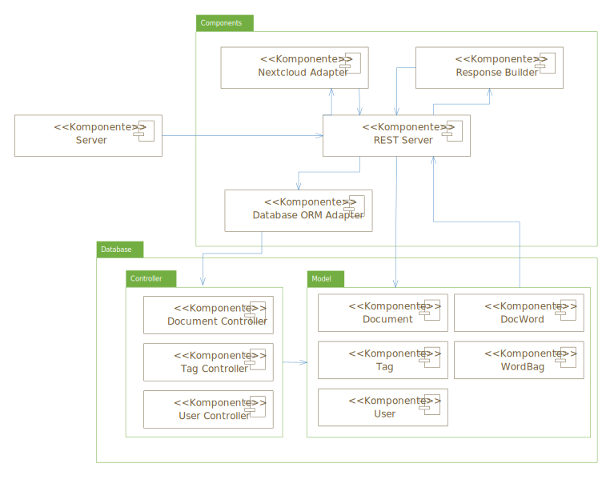
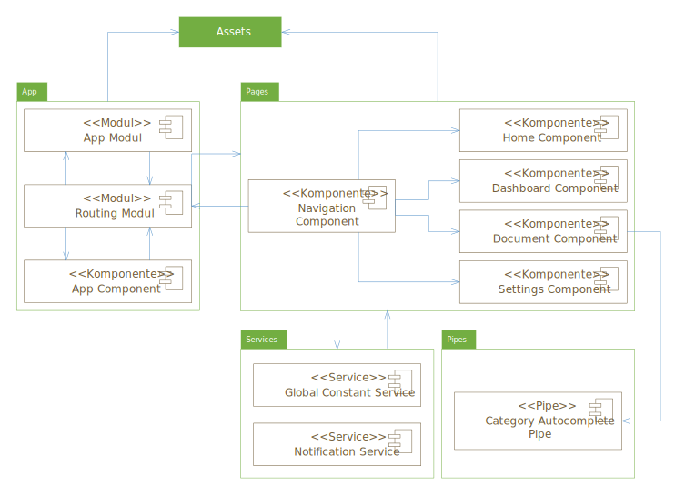


# DocVer Dokumentation

**Modul:** Datenbankanwendungen

**Studierende:** Ken Madlehn, André Grellmann, Pia Schreiner

## Einleitung

DocVer ist ein System zum Verwalten von Dokumenten, das im Browser läuft und für Mobilgeräte optimiert ist. Durch die Analyse verwalteter Dokumente, bietet es eine Volltextsuche über alle Dokumente an. Optional, bietet DocVer außerdem eine Schnittstelle für Erweiterungen, welche tiefere Analysen der Dokumente ermöglicht. Durch eine strukturierte Darstellung hochgeladener Dokumente bekommt der Nutzer eine einfache und zeiteffiziente Möglichkeit, seine Dokumente zu durchsuchen und notwendige Dokumente schnell zu finden.

Zum Benutzen von DocVer wird ein kompatibles Gerät mit Webbrowser und Internetverbindung benötigt. In der derzeitigen Version wird der Google Chrome Browser benötigt. Das System soll dadurch sehr zugänglich und für eine breite Nutzergruppe geeignet sein. Jede Person, die ihre Dokumente verwalten möchte und einen PC mit Scanner, ein Smartphone, ein Tablet o.ä. besitzt, soll dies mit unserem Service machen können. Auch für (derzeit noch kleinere) Organisationen ist das System geeignet.

## Planung

### Idee

Das System soll digitalisierte Dokumente, wie z.B. Fotos oder Scans verwalten können. Dafür sollen diese hochgeladen werden und anschließend automatisch zum Nutzer zugeordnet gespeichert, mit optischer Zeichenerkennung (OCR) analysiert und in durchsuchbare PDFs umgewandelt werden. Außerdem sollen sie klassifiziert werden können. Für die Klassifizierung hat der Nutzer einige Standard Kategorien, welche bereits angelegt worden sind und nicht gelöscht werden können. Weiterhin kann jeder Nutzer sich eigene Kategorien anlegen, in welche er seine Dokumente anschließend klassifizieren kann. Die Klassifizierung soll zunächst manuell erfolgen, in dem der Nutzer entweder beim Upload eines Dokuments die Kategorie auswählt, oder das Dokument später in einer Kategorie klassifiziert. Nachdem die Dokumente in das System aufgenommen wurden, soll eine Volltextsuche über diese möglich sein und eine Übersicht über sie gegeben werden. Auch kann eine Suche nach Begriffen durchgeführt werden, welche Dokumente liefert, die diese Begriffe enthalten. Die Anwendung soll mittels eines Browsers mobil (via Smartphone oder Tablet) sowie lokal (am PC) benutzbar sein.

Falls genug Zeit gegen Ende übrig bleibt, wäre eine automatische Klassifizierung denkbar, die hochgeladene Dokumente automatisch in die passende Kategorie einsortieren kann. Außerdem wäre eine Schnittstelle mit erweiternder Funktionalität möglich, welche tiefere Analysen der Dokumente durchführt und es ermöglicht Zusatzmodule zu implementieren, welche die Daten analysiert. Ein Beispiel dafür wäre ein automatisches Fahrtenbuch, welches aus Daten von Tankquittungen erstellt wurde.

### Mockups

#### Home Ansicht

#### Dashboard Ansicht

#### Dokumentenansicht

#### Dokumentenansicht - Dokument löschen

#### Dokumentenansicht - Dokument hinzufügen

#### Dokumentenansicht - Detailansicht

#### Einstellungen

#### Mobile Ansicht

### Datenbankentwurf

#### ER Diagramm

#### Stored Functions
|  Stored Function  |          Input         |             Output             | Funktion |
|-------------------|------------------------|--------------------------------|-----------|
| F_DOC_SEARCH_BY_KEYWORDS | userId (CHAR), keywords (VARCHAR2), minimum_matches(NUMBER) | docIds (VARCHAR2) | Gibt eine Liste mit DokumentenIds, die min. eines der Keywords enthalten, zurück. |
| F_DOC_GET_FULLTEXT | docId(NUMBER) | fulltext(VARCHAR2) | Setzt den gemerierten Text eines Dokuments zusammen und gibt ihn zurück. |
| F_DOC_STORE_ANALYSED | docId (NUMBER), pdfPath (VARCHAR2), fullText (VARCHAR2) | - | Speichert alle, beim analysieren generierte, Daten in der Datenbank. |

#### Trigger
|      Trigger      |      Zeitpunkt      |               Funktion               |
|-------------------|---------------------|--------------------------------------|
| DeleteUnusedWords | ON_DELETE(Document) | Löscht unbenutzte Wörter aus Wordbag |

### Systementwurf

#### Backend

#### Frontend

#### Gesamtüberblick

### Kommunikationsentwurf

Es gibt drei wichtige Kommunikationsrouten. Die erste ist zwischen dem Frontend und dem Backend. Das Backend stellt dafür einige REST-Schnittstellen zur Verfügung. Eine Übersicht über diese ist weiter unten im Abschnitt "Schnittstellenübersicht" zu finden. Die zweite wichtige Kommunikationsroute ist die für die Kommunikation zwischen dem Node-Server und der Datenbank. Dafür wird das ORM Framework Sequelize genutzt. Die Kommunikation zwischen diesem und dem DBMS läuft über TCP. Die letzte wichtige Route ist die von dem Node-Server zur Nextcloud. Dort liegen alle Dokumente, welche verwaltet werden. Dabei wird über die WebDAV Schnittstelle kommuniziert und Dateien hoch- oder heruntergeladen.

#### Darstellung des Ablaufs

#### Schnittstellenübersicht

##### Dokumenten Schnittstelle - Basisroute: /documents

| HTTP |      Route        |      Parameter      |               Body                   | Funktion |
|--------------|-------------------|---------------------|-----------------------|----------|
| POST | /create | -- | Neues Dokument inkl. Rohdatei | Dokument zum System hinzufügen |
| GET | /user | /:userId | -- | Alle Dokumente des Users erhalten |
| GET | /time | /:userId/:minTime/:maxTime | -- | Alle Dokumente des Users erhalten, die in einem bestimmten Zeitraum hinzugefügt wurden |
| GET | /keywords | /:userId/:keywords | -- | Alle Dokumente des Users erhalten, die min. eines der Keywords enthalten |
| GET | /text | /:docId | -- | Den generierten Volltext des Dokuments erhalten |
| GET  | /content | /:docId | -- | Rohdatei des Dokuments als Base64-String erhalten |
| GET  | /pdf | /:docId | -- | Generierte PDF-Datei des Dokuments als Base64-String erhalten |
| POST | /tag | /:docId | Neues Tag-Objekt | Tag für den User erstellen und zum Dokument hinzufügen |
| PUT | /tag | /:docId | Bestehendes Tag-Objekt | Einen Tag zum Dokument hinzufügen |
| PUT | /tags | /:docId | Liste mit Ids bestehender Tags | Mehrere Tags zum Dokument hinzufügen |
| DELETE | /tag | /:docId/:tagId | -- | Einen Tag vom Dokument entfernen |
| POST | /favorize | /:userId/:docId | -- | Dokument eines Users zu Favoriten hinzufügen |
| POST | /unfavorize | /:userId/:docId | -- | Dokument eines Users von Favoriten entfernen |
| DELETE | -- | /:docId | -- | Dokument löschen |

##### **Tag Schnittstelle - Basisroute: /tags**

| HTTP |      Route        |      Parameter      |               Body                   | Funktion |
|--------------|-------------------|---------------------|-----------------------|----------|
| GET | /user | /:userId | -- | Alle Tags des Users erhalten |
| POST | /create | -- | Neues Tag-Objekt | Neuen Tag erstellen |
| POST | /update | /:tagId | Tag-Objekt | Tag updaten |
| DELETE | -- | /:tagId | -- | Tag löschen |

##### **User Schnittstelle - Basisroute: /user**

| HTTP |      Route        |      Parameter      |               Body                   | Funktion |
|--------------|-------------------|---------------------|-----------------------|----------|
| POST | /register | -- | Nickname, Email und Passwort des neuen Users | User auf der Firebase registrieren und UserId enthalten |
| POST | /verify | /:token | -- | Usertoken authentifizieren |
| POST | /update | /:uid | Nickname, Email und Passwort des Users | Daten des Users updaten |

### Offline Nutzung

- Konzeption zur Offline Nutzung ergänzen (Pia)

## Features

### Dokumentenverwaltung mit Klassifizierung

- Nutzer können Dokumente hochladen um diese zu verwalten
- Verwaltete Dokumente werden in einer übersichtlichen Liste dargestellt
- In der Detailansicht eines Dokuments, können Nutzer die Originaldatei, eine Volltextvorschau sowie die generierte PDF einsegen
- Zur besseren Übersicht können Dokumente mit Hilfe von Kategorien klassifiziert werden
- Für die Klassizierung werden Standard Kategorien angeboten.
- Nutzer haben Zugriff auf eine Dashboardansicht, welche die letzten Dokumente sowie die Favoriten darstellt

### Dokumentensuche

- Nutzer können die gelisteten Dokumente durchsuchen
- Dabei ist eine Filterung der Tabelle sowie eine Inhaltssuche welche den Inhalt der Dokumente filtert möglich

### Nutzereinstellungen

- Nutzer können sich registrieren sowie ihre Nutzerdaten aktualisieren
- Jeder Nutzer hat die Möglichkeit eigene Kategorien anzulegen

### OCR Analyse
- Ausführliche Stichpunkte formulieren (Ken)

## Genutzte Technologien

### Docker als Environment

- Deployment Übersicht
  - Welche Container?
  - Wie deployed?
(Ken)

### OCR Analyse 

- Genauere Erklärung zur Umsetzung
- Welche OCR Lib
(Ken)

### Nextcloud

Ein selbst gehosteter Nextcloud Server wird bei diesem Projekt als Webspeicher für die hochgeladenen Dokumente und generierten PDFs genutzt. Zum Hoch- und Runterladen der Dateien wird die WebDAV Schnittstelle der Nextcloud verwendet.

### Oracle Datenbank

- Genauere Erklärung zur Umsetzung mit Tablespaces, Nutzer, Stored Procedures etc.
(Ken)

### Node JS

Genutzt für dieses Projekt wird ein mit Docker gehosteter Node Container mit der LTS Version. Bei der Strukturierung des Backends haben wir eine modulare Struktur genutzt. Folgende Module und Libraries verwenden wir.

#### Database ORM Adapter

Um das Backend mit der Datenbank zu verwenden wird das ORM Framework `Sequelize` genutzt. Da dieses in der aktuellen Version keine Oracle Datenbank unterstützt, wird auf einen Fork dieses Frameworks in der Version 3 zurückgegriffen Um dieses nutzen zu können wird darüber hinaus eine Library verwendet, welche die Oracle Datenbanktreiber enthält. Innerhalb des Datenbankadapters verwenden wir eine Model und Controller Struktur. Für jede Datenbanktabelle wurde somit ein Model und ein Controller angelegt. Das Model enthält die Tabellendefinition und im Controller sind alle Datenbankoperationen und Funktionsaufrufe zu finden, welche mit dieser Tabelle zusammenhängen. Folgende Libraries sind dafür im Node Server notwendig:

- [sequelize-oracle](https://www.npmjs.com/package/sequelize-oracle)

- [oracledb](https://www.npmjs.com/package/oracledb)

#### REST Server

Damit die Webanwendung mit dem Backend kommunizieren kann arbeiten wir mit REST Routen. Dafür ist auch eine Middleware notwendig, welche den Request Body parsen kann. Einige REST Routen sind dabei so definiert, dass diese direkt die Funktionen aus den Datenbank Controllern aufrufen, womit es sehr einfach ist Datenbankoperationen aus der Webanwendung zu triggern.

- [express ](https://www.npmjs.com/package/express)
- [body-parser](https://www.npmjs.com/package/body-parser)

#### Firebase Adapter

Da die Anwendung nutzerbasiert funktionieren soll, ist eine Authentifizierungsmöglichkeit notwendig. Diese ist mit Hilfe von Firebase umgesetzt. Dies ist ein Google Service, zur Nutzerverwaltung und Authentifizierung. Auf der Serverseite wird dabei das Admin SDK für Node verwendet, um Funktionen, wie z.B die Nutzerverifizierung oder die Registrierung neuer Nutzer, durchführen zu können.

- [firebase-admin](https://www.npmjs.com/package/firebase-admin)

#### Nextcloud Adapter

Da in der Datenbank nur der Dokumentenpfad gespeichert wird, ist es notwendig zusätzlich einen WebDAV Dienst zu nutzen, welcher die hochgeladenen Dateien nutzerbasiert speichert. Dabei haben wir uns für den Dienst Nextcloud entschieden. Dieser bietet eine einfache Client API mit Hilfe dessen Dateien erstellt, ausgelesen und gelöscht werden können.

- [nextcloud-node-client](https://www.npmjs.com/package/firebase-admin)

- [file-type](https://www.npmjs.com/package/file-type)

#### Logging

Um nach dem Deploy auf die Umgebung einfach Fehler finden zu können, wurde ein Logging System implementiert. Dabei gibt es drei verschiedene Dateien (Info, Error, Debug), welche mit Hilfe einer REST Route erreichbar sind und welche den Loginhalt basiert auf Logleveln ausgeben können.

- [fs](https://www.npmjs.com/package/fs)
- [util](https://www.npmjs.com/package/util)

### Angular

#### Design

Das Design der Webanwendung basiert grundsätzlich auf dem Bootstrap Framework in der Version 4. Da dieses aber keine Icons enthält sowie einige andere nützliche Komponenten nutzen wir zusätzlich die Angular Material Bibliothek, dessen Icons wir verwenden. Die Anwendung ist dabei komplett responsiv und passt sich auf alle Endgeräte mit der Größe an. Um das Design modern wirken zu lassen, werden bei allen Aktionen mit dem Backend Push Notifications angezeigt, welche dem Nutzer den Status der Aktion mitteilen. Diese können beliebig platziert werden, je nachdem ob gerade ein Modal geöffnet ist, oder nicht.

- [@ng-bootstrap/ng-bootstrap](https://www.npmjs.com/package/@ng-bootstrap/ng-bootstrap)
- [@angular/material](https://www.npmjs.com/package/@angular/material)
- [ngx-toastr](https://www.npmjs.com/package/ngx-toastr)

#### Authentifizierung

Für die Nutzerauthentifizierung in der Webanwendung nutzen wir die clientseitige Firebasebibliothek, welche z.B. Funktionen wie Login und Passwort zurücksetzen anbietet. Dabei erstellen wir uns einen Eintrag im Local Storage, wenn der Nutzer eingeloggt ist, um diesen eingeloggt zu lassen, sollte die Seite neu geladen werden. Der Nutzer wird dabei automatisch ausgeloggt, sollte das Token der Firebase auslaufen und somit kann der Nutzer nicht dauerhaft eingeloggt bleiben.

- [firebase](https://www.npmjs.com/package/firebase)

#### Dokumentendetail Anzeige

Der Hauptfokus der Anwendung ist die Dokumentenverwaltung. Im Rahmen dieser, kann man sich von allen Dokumenten in der Liste eine Detailansicht anzeigen lassen. Diese bietet eine Dreiteilung der Ansicht mit Hilfe einer Tableiste. Im ersten Tab wird dabei das hochgeladene Bild oder die hochgeladene PDF als original Datei angezeigt. Der zweite Tab stellt eine Volltextvorschau des Dokumententextes dar und der dritte Tab stellt die generierte PDF nach der OCR Analyse mit Hilfe eines PDF Viewers da. Dafür werden die anzuzeigenden PDFs als eingebetteter Viewer angezeigt, welcher auch Funktionalitäten wie z.B. die Suche anbietet.

- [ng2-pdfjs-viewer](https://www.npmjs.com/package/ng2-pdfjs-viewer)

#### Klassifizierung mit Kategorien

Um dem Nutzer eine gute Usability zu bieten, verwenden wir ein Tag Input Feld. Dieses bietet eine Vorauswahl der vorhandenen Kategorien und ein einfaches Entfernen bereits vorhandener Kategorien von einem Dokument. Auch können so sehr einfach neue Kategorien hinzugefügt werden, welche vorher nicht existiert haben. Dieses Tag Input Feld wird in allen Komponenten verwendet. Auf der Dokumentenübersicht sowie beim Dokument hochladen ist dieses Feld editierbar. Auf dem Dashboard wird das Tag Input Feld nur genutzt, um vorhandene Kategorien hinzuzufügen. Hier ist kein Bearbeiten möglich.

- [ngx-tags-input](https://www.npmjs.com/package/ngx-tags-input)

- https://www.npmjs.com/package/ng-connection-service)

## Fazit

- Mit modernen ORM Frameworks sollte man Oracle nicht nutzen
- Das Erstellen von DB Funktionen mit Oracle ist mühsam (schlechte Debugging Möglichkeiten) 
- Nextcloud evtl. etwas langsam
- Mehr Sicherheit durch Authentifizierung bei REST-Schnittstellen

## Ausblick

- Satzzeichen könnten als Wörter behandelt werden um die Suche zu verbessern
	- Derzeit Satzzeichen am Wort direkt und daher evtl. nicht als Suchergebnis
- Es wäre möglich, die Firebase mit einer eigenen Authentifizierungsmöglichkeit zu ersetzen

Als Erweiterung des Systems, wäre eine automatische Klassifizierung denkbar, die hochgeladene Dokumente automatisch in die passende Kategorie einsortieren kann. Außerdem wäre eine Schnittstelle mit erweiternder Funktionalität möglich, die tiefere Analysen der Dokumente durchführt und es ermöglicht, Zusatzmodule zu implementieren, welche die Daten analysieren. Ein Beispiel dafür wäre ein automatisches Fahrtenbuch, das aus Daten von Tankquittungen erstellt wird.

- Dokumente die ausstehend sind werden automatisch refresht - mit Hilfe von Websockets 
- Ausloggen beim ändern der Email könnte umgangen werden, wenn man sich ein Passwort bestätigen lässt um den Nutzer programmatisch wieder einzuloggen