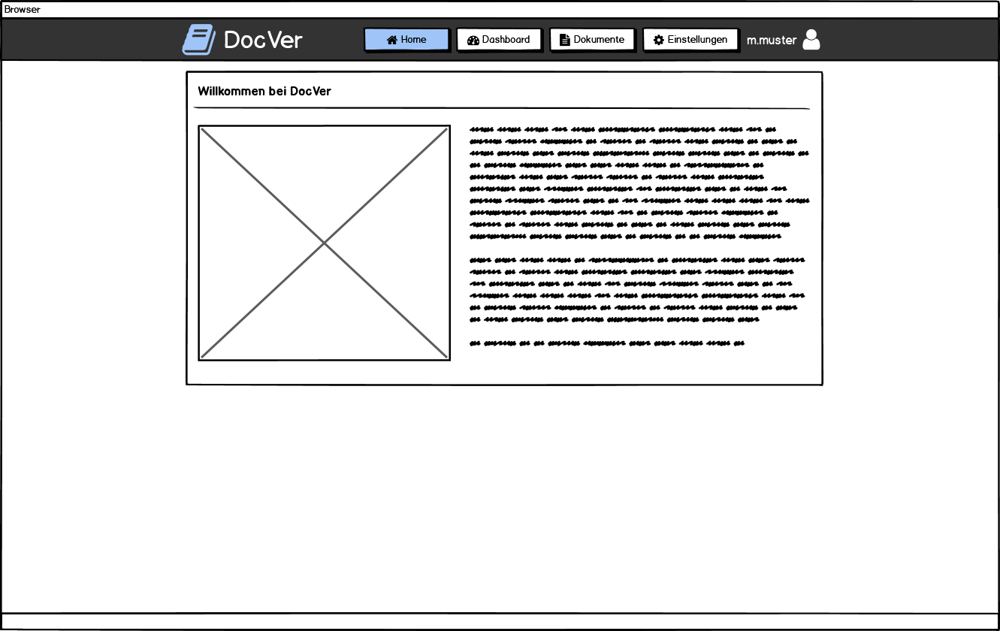
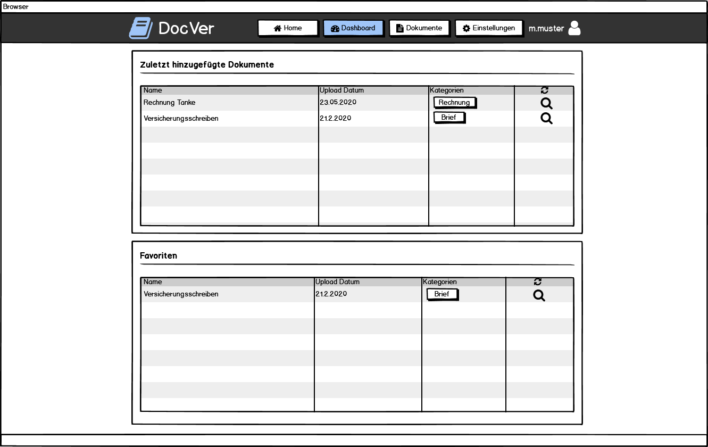
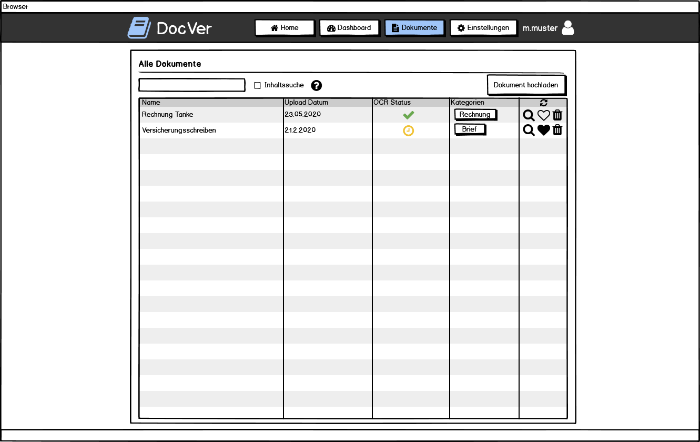
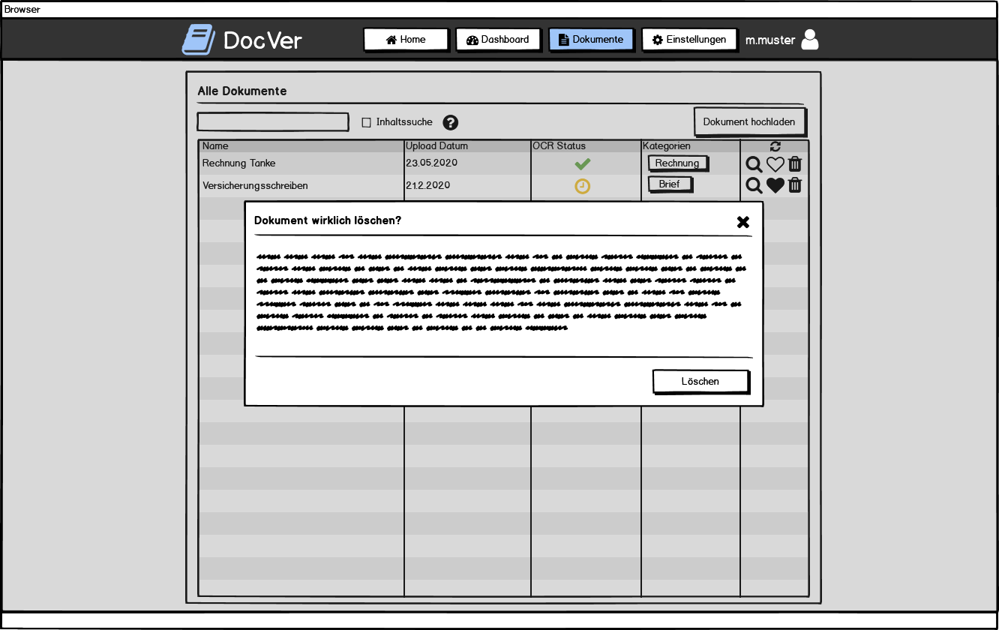
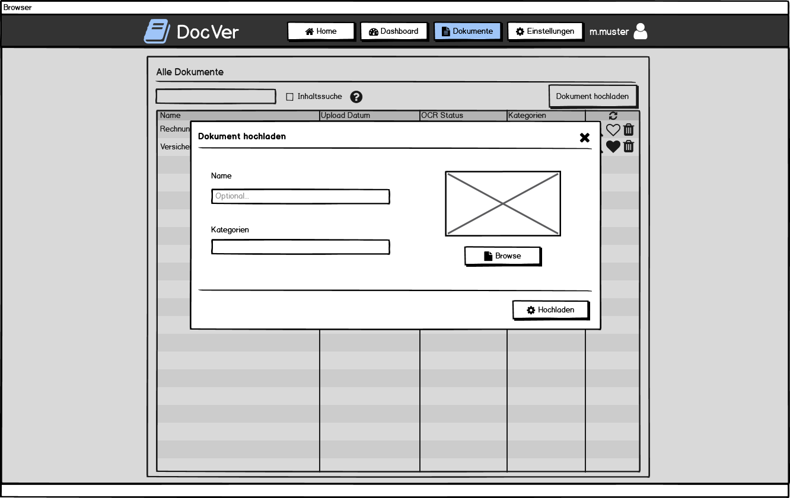
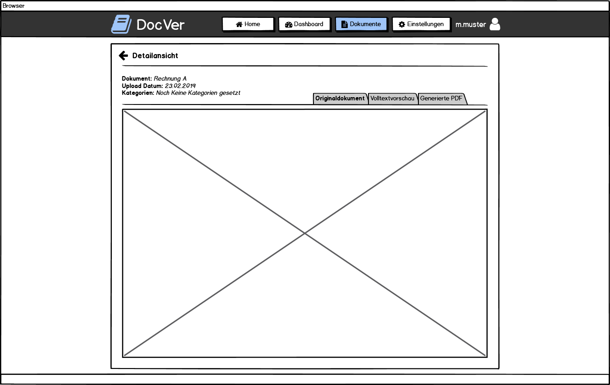
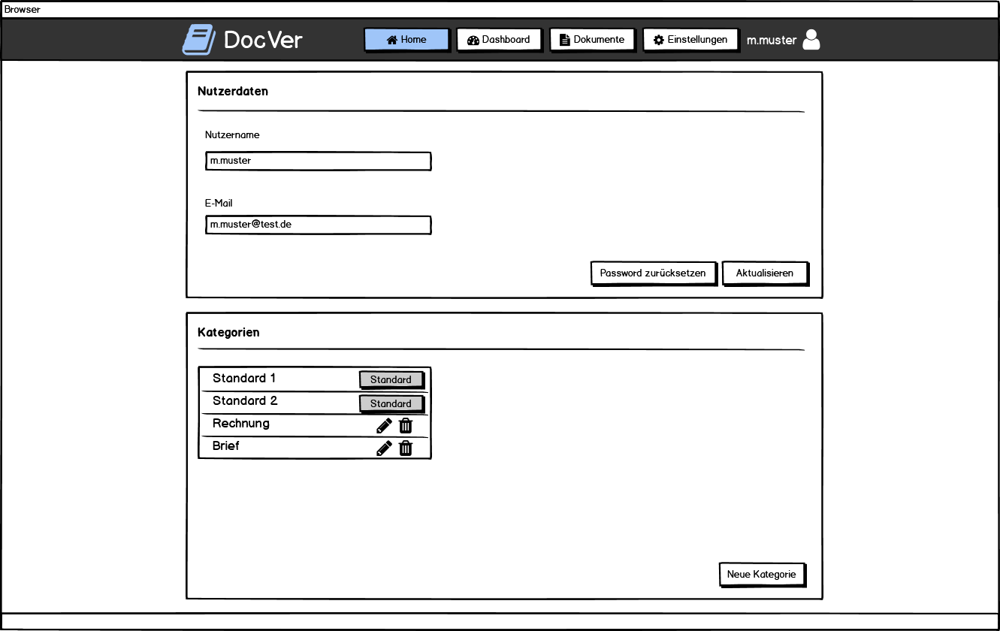
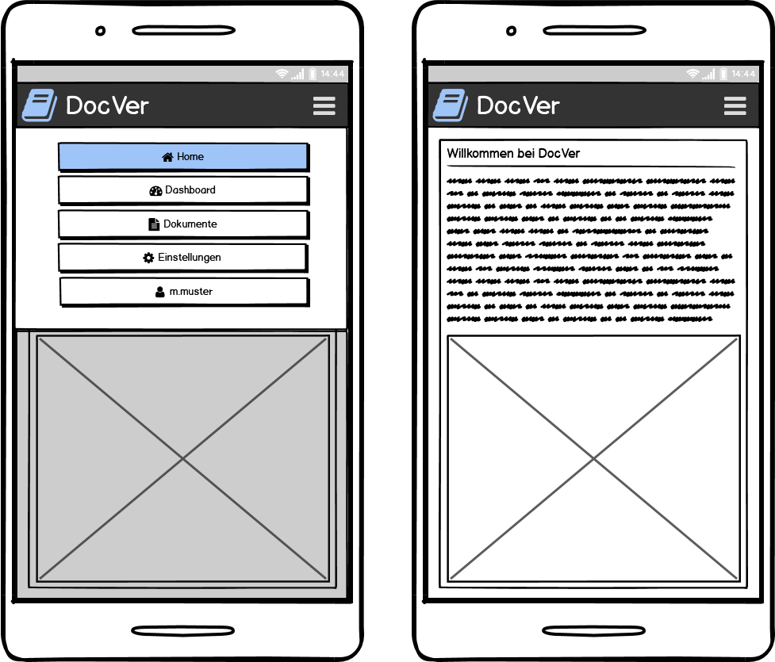
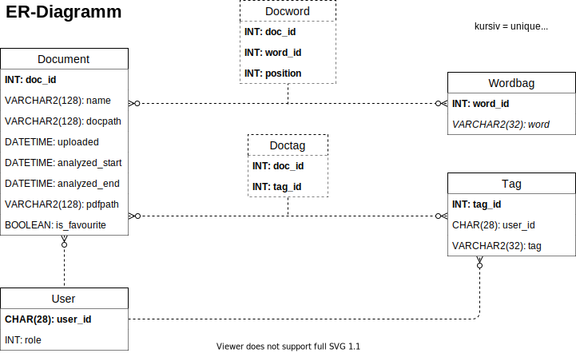
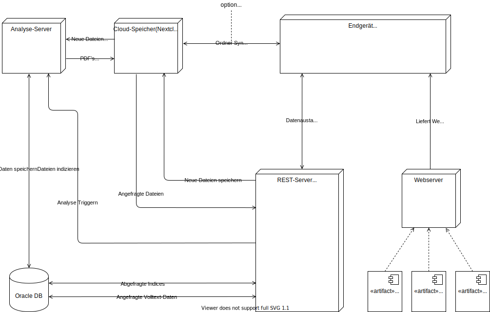

# DocVer Dokumentation

**Modul:** Datenbankanwendungen

**Studierende:** Ken Madlehn, André Grellmann, Pia Schreiner

## Einleitung

Das System soll digitalisierte Dokumente, wie z.B. Fotos oder Scans verwalten können. Dafür sollen diese hochgeladen werden und anschließend automatisch zum Nutzer zugeordnet gespeichert, mit optischer Zeichenerkennung (OCR) analysiert und in durchsuchbare PDFs umgewandelt werden. Außerdem sollen sie klassifiziert werden können. Für die Klassifizierung hat der Nutzer einige Standard Kategorien, welche bereits angelegt worden sind und nicht gelöscht werden können. Weiterhin kann jeder Nutzer sich eigene Kategorien anlegen, in die er seine Dokumente anschließend klassifizieren kann. Die Klassifizierung soll zunächst manuell erfolgen, in dem der Nutzer entweder beim Upload eines Dokuments die Kategorie auswählt, oder das Dokument später in einer Kategorie klassifiziert. Nachdem die Dokumente in das System aufgenommen wurden, soll eine Volltextsuche über diese möglich sein und eine Übersicht über sie gegeben werden. Auch kann eine Suche nach Begriffen durchgeführt werden, welche Dokumente liefert, die diese Begriffe enthalten. Die Anwendung soll mittels eines Browsers mobil (via Smartphone oder Tablet) sowie lokal (am PC) benutzbar sein.

- Zielgruppe (Andre)

## Planung

### Idee

Das System soll digitalisierte Dokumente, wie z.B. Fotos oder Scans verwalten können. Dafür sollen diese hochgeladen werden und anschließend automatisch zum Nutzer zugeordnet gespeichert, mit optischer Zeichenerkennung (OCR) analysiert und in durchsuchbare PDFs umgewandelt werden. Außerdem sollen sie klassifiziert werden können. Für die Klassifizierung hat der Nutzer einige Standard Kategorien, welche bereits angelegt worden sind und nicht gelöscht werden können. Weiterhin kann jeder Nutzer sich eigene Kategorien anlegen, in welche er seine Dokumente anschließend klassifizieren kann. Die Klassifizierung soll zunächst manuell erfolgen, in dem der Nutzer entweder beim Upload eines Dokuments die Kategorie auswählt, oder das Dokument später in einer Kategorie klassifiziert. Nachdem die Dokumente in das System aufgenommen wurden, soll eine Volltextsuche über diese möglich sein und eine Übersicht über sie gegeben werden. Auch kann eine Suche nach Begriffen durchgeführt werden, welche Dokumente liefert, die diese Begriffe enthalten. Die Anwendung soll mittels eines Browsers mobil (via Smartphone oder Tablet) sowie lokal (am PC) benutzbar sein.

Falls genug Zeit gegen Ende übrig bleibt, wäre eine automatische Klassifizierung denkbar, die hochgeladene Dokumente automatisch in die passende Kategorie einsortieren kann. Außerdem wäre eine Schnittstelle mit erweiternder Funktionalität möglich, welche tiefere Analysen der Dokumente durchführt und es ermöglicht Zusatzmodule zu implementieren, welche die Daten analysiert. Ein Beispiel dafür wäre ein automatisches Fahrtenbuch, welches aus Daten von Tankquittungen erstellt wurde.

### Mockups

#### Home Ansicht

#### Dashboard Ansicht

#### Dokumentenansicht

#### Dokumentenansicht - Dokument löschen

#### Dokumentenansicht - Dokument hinzufügen

#### Dokumentenansicht - Detailansicht

#### Einstellungen

#### Mobile Ansicht

### Datenbankentwurf

#### ER Diagramm

#### Stored Procedures
- Funktion hinzufügen (Andre)
- Stored Procedure zu Funktion setzen (Andre)

| Stored Procedure | Input |
|------------------|-------|
| StoreAnalyzedDoc | Document.doc:_id, Document.analyzed_start, Document.analyzed_end, Document.pdfpath, words |

#### Stored Functions
|  Stored Function  |          Input         |             Output             |
|-------------------|------------------------|--------------------------------|
| GetDocsByKeywords | User.user_id, keywords | Document.doc_id, Document.name |
| GetDocsByUserAndExpression | User.user_id, expression | Document.doc_id, Document.name |
| GetFullDocText | Document.doc_id | Document.name, doc_text |

#### Trigger
|      Trigger      |      Zeitpunkt      |               Funktion               |
|-------------------|---------------------|--------------------------------------|
| DeleteUnusedWords | ON_DELETE(Document) | Löscht unbenutzte Wörter aus Wordbag |

### Systementwurf

#### Frontend

- Strukturdiagramm NodeJS Server (Pia)

#### Backend

- Strukturdiagramm Angular App (Pia)

#### Gesamtüberblick

### Kommunikationsentwurf

- Allgemeiner Text zur Kommunikation

  - Kommunikation zwischen Frontend und Backend über REST Routen
  - Kommunikation zwischen Datenbank und Backend mittels ORM Framework und TCP
  - Kommunikation zwischen Backend und Nextcloud?

#### Darstellung des Ablaufs

#### Schnittstellenübersicht

(Andre)

|      Route        |      Parameter      |               Body                   | Funktion |
|-------------------|---------------------|--------------------------------------|----------|
||  |  | |

## Features

- alle Features unter Kategorie als ausführliche Stichpunkte formulieren

### Dokumentenverwaltung mit Klassifizierung

- Dokumente hochladen
- Kategorienverwaltung
- Dokumente in Kategorien ordnen
- Dashboard Ansicht
(Andre)

### OCR Analyse
(Ken)

### Offline Nutzung

- Cachen der Seite mittels PWA
- Cachen der Volltextvorschau von bereits geöffneten Dokumenten
(Pia)

## Genutzte Technologien

### Docker als Environment

- Deployment Übersicht
  - Welche Container?
  - Wie deployed?
(Ken)

### OCR Analyse 

- Genauere Erklärung zur Umsetzung
- Welche OCR Lib
(Ken)

### Nextcloud

- Datenablage der Original Files
- Datenablage der generierten PDFs
(Andre)

### Oracle Datenbank

- Genauere Erklärung zur Umsetzung mit Tablespaces, Nutzer, Stored Procedures etc.
(Ken)

### Node JS

- Libs und kurze Erklärung
(Pia)

### Angular

- Libs und kurze Erklärung
(Pia)

## Fazit

- Mit modernen ORM Frameworks sollte man Oracle nicht nutzen
- Das Erstellen von DB Funktionen mit Oracle ist mühsam (schlechte Debugging Möglichkeiten) 

## Ausblick

- Satzzeichen könnten als Wörter behandelt werden um die Suche zu verbessern
	- Derzeit Satzzeichen am Wort direkt und daher evtl. nicht als Suchergebnis
- Es wäre möglich, die Firebase mit einer eigenen Authentifizierungsmöglichkeit zu ersetzen