# DocVer Dokumentation

**Modul:** Datenbankanwendungen

**Studierende:** Ken Madlehn, André Grellmann, Pia Schreiner

**Link zu GitHub Pages**: https://doc-ver.github.io/Doku/

**Source Code:** https://github.com/doc-ver

## Einleitung

DocVer ist ein System zum Verwalten von Dokumenten, das im Browser läuft und für Mobilgeräte optimiert ist. Durch die Analyse verwalteter Dokumente, bietet es eine Volltextsuche über alle Dokumente an. Optional, bietet DocVer außerdem eine Schnittstelle für Erweiterungen, welche tiefere Analysen der Dokumente ermöglicht. Durch eine strukturierte Darstellung hochgeladener Dokumente bekommt der Nutzer eine einfache und zeiteffiziente Möglichkeit, seine Dokumente zu durchsuchen und notwendige Dokumente schnell zu finden.

Zum Benutzen von DocVer wird ein kompatibles Gerät mit Webbrowser und Internetverbindung benötigt. In der derzeitigen Version wird der Google Chrome Browser benötigt. Das System soll dadurch sehr zugänglich und für eine breite Nutzergruppe geeignet sein. Jede Person, die ihre Dokumente verwalten möchte und einen PC mit Scanner, ein Smartphone, ein Tablet o.ä. besitzt, soll dies mit unserem Service machen können. Auch für (derzeit noch kleinere) Organisationen ist das System geeignet.

## Planung

### Idee

Das System soll digitalisierte Dokumente, wie z.B. Fotos oder Scans verwalten können. Dafür sollen diese hochgeladen werden und anschließend automatisch zum Nutzer zugeordnet gespeichert, mit optischer Zeichenerkennung (OCR) analysiert und in durchsuchbare PDFs umgewandelt werden. Außerdem sollen sie klassifiziert werden können. Für die Klassifizierung hat der Nutzer einige Standard Kategorien, welche bereits angelegt worden sind und nicht gelöscht werden können. Weiterhin kann jeder Nutzer sich eigene Kategorien anlegen, in welche er seine Dokumente anschließend klassifizieren kann. Die Klassifizierung soll zunächst manuell erfolgen, in dem der Nutzer entweder beim Upload eines Dokuments die Kategorie auswählt, oder das Dokument später in einer Kategorie klassifiziert. Nachdem die Dokumente in das System aufgenommen wurden, soll eine Volltextsuche über diese möglich sein und eine Übersicht über sie gegeben werden. Auch kann eine Suche nach Begriffen durchgeführt werden, welche Dokumente liefert, die diese Begriffe enthalten. Die Anwendung soll mittels eines Browsers mobil (via Smartphone oder Tablet) sowie lokal (am PC) benutzbar sein.

### Mockups

#### Home Ansicht

#### Dashboard Ansicht

#### Dokumentenansicht

#### Dokumentenansicht - Dokument löschen

#### Dokumentenansicht - Dokument hinzufügen

#### Dokumentenansicht - Detailansicht

#### Einstellungen

#### Mobile Ansicht

### Datenbankentwurf

#### ER Diagramm

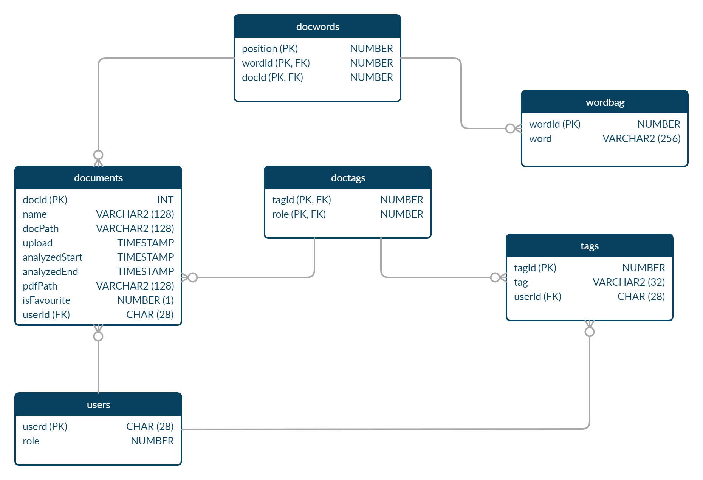

#### Stored Functions
|  Stored Function  |          Input         |             Output             | Funktion |
|-------------------|------------------------|--------------------------------|-----------|
| F_DOC_SEARCH_BY_KEYWORDS | userId (CHAR), keywords (VARCHAR2), minimum_matches(NUMBER) | docIds (VARCHAR2) | Gibt eine Liste mit DokumentenIds, die min. eines der Keywords enthalten, zurück. |
| F_DOC_GET_FULLTEXT | docId(NUMBER) | fulltext(VARCHAR2) | Setzt den gemerierten Text eines Dokuments zusammen und gibt ihn zurück. |
| F_DOC_STORE_ANALYSED | docId (NUMBER), pdfPath (VARCHAR2), fullText (VARCHAR2) | - | Speichert alle, beim analysieren generierte, Daten in der Datenbank. |

#### Trigger
|      Trigger      |      Zeitpunkt      |               Funktion               |
|-------------------|---------------------|--------------------------------------|
| DeleteUnusedWords | ON_DELETE(Document) | Löscht unbenutzte Wörter aus Wordbag |

### Systementwurf

#### Backend

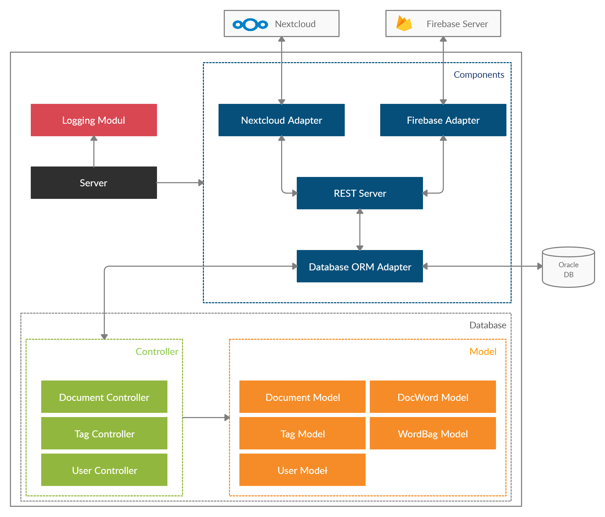

#### Frontend

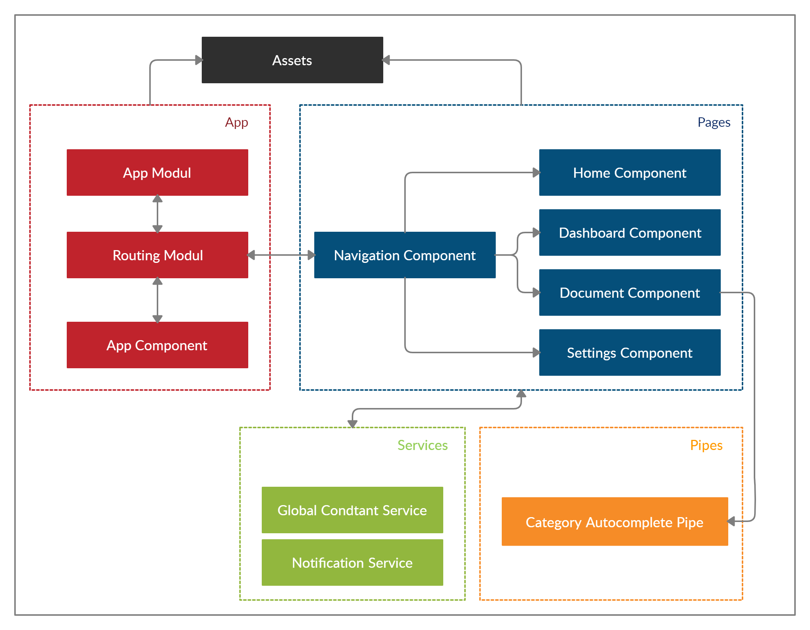

#### Gesamtüberblick

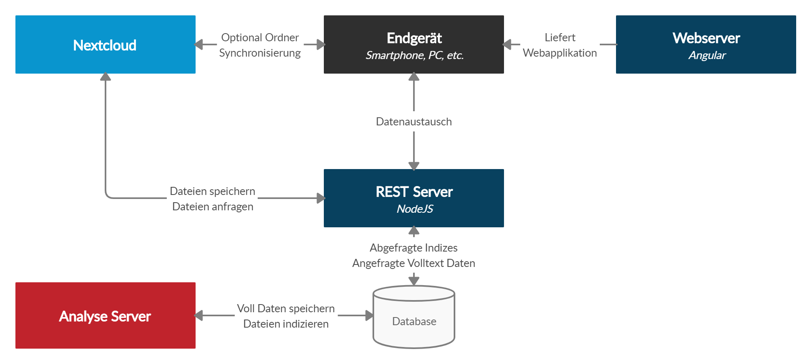

### Kommunikationsentwurf

Es gibt drei wichtige Kommunikationsrouten. Die erste ist zwischen dem Frontend und dem Backend. Das Backend stellt dafür einige REST-Schnittstellen zur Verfügung. Eine Übersicht über diese ist weiter unten im Abschnitt "Schnittstellenübersicht" zu finden. Die zweite wichtige Kommunikationsroute ist die für die Kommunikation zwischen dem Node-Server und der Datenbank. Dafür wird das ORM Framework Sequelize genutzt. Die Kommunikation zwischen diesem und dem DBMS läuft über TCP. Die letzte wichtige Route ist die von dem Node-Server zur Nextcloud. Dort liegen alle Dokumente, welche verwaltet werden. Dabei wird über die WebDAV Schnittstelle kommuniziert und Dateien hoch- oder heruntergeladen.

#### Darstellung des Ablaufs

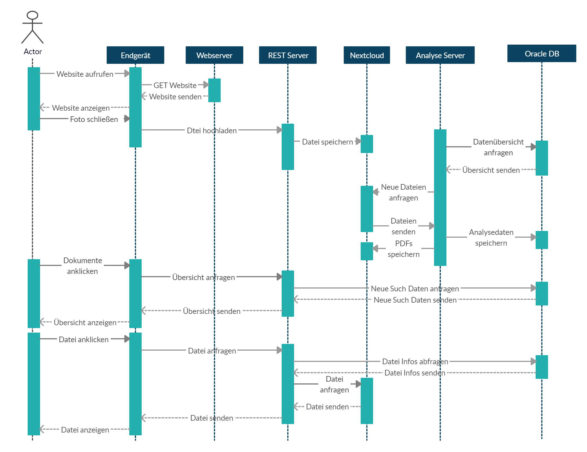

#### Schnittstellenübersicht

##### Dokumenten Schnittstelle - Basisroute: /documents

| HTTP |      Route        |      Parameter      |               Body                   | Funktion |
|--------------|-------------------|---------------------|-----------------------|----------|
| POST | /create | -- | Neues Dokument inkl. Rohdatei | Dokument zum System hinzufügen |
| GET | /user | /:userId | -- | Alle Dokumente des Users erhalten |
| GET | /time | /:userId/:minTime/:maxTime | -- | Alle Dokumente des Users erhalten, die in einem bestimmten Zeitraum hinzugefügt wurden |
| GET | /keywords | /:userId/:keywords | -- | Alle Dokumente des Users erhalten, die min. eines der Keywords enthalten |
| GET | /text | /:docId | -- | Den generierten Volltext des Dokuments erhalten |
| GET  | /content | /:docId | -- | Rohdatei des Dokuments als Base64-String erhalten |
| GET  | /pdf | /:docId | -- | Generierte PDF-Datei des Dokuments als Base64-String erhalten |
| POST | /tag | /:docId | Neues Tag-Objekt | Tag für den User erstellen und zum Dokument hinzufügen |
| PUT | /tag | /:docId | Bestehendes Tag-Objekt | Einen Tag zum Dokument hinzufügen |
| PUT | /tags | /:docId | Liste mit Ids bestehender Tags | Mehrere Tags zum Dokument hinzufügen |
| DELETE | /tag | /:docId/:tagId | -- | Einen Tag vom Dokument entfernen |
| POST | /favorize | /:userId/:docId | -- | Dokument eines Users zu Favoriten hinzufügen |
| POST | /unfavorize | /:userId/:docId | -- | Dokument eines Users von Favoriten entfernen |
| DELETE | -- | /:docId | -- | Dokument löschen |

##### **Tag Schnittstelle - Basisroute: /tags**

| HTTP |      Route        |      Parameter      |               Body                   | Funktion |
|--------------|-------------------|---------------------|-----------------------|----------|
| GET | /user | /:userId | -- | Alle Tags des Users erhalten |
| POST | /create | -- | Neues Tag-Objekt | Neuen Tag erstellen |
| POST | /update | /:tagId | Tag-Objekt | Tag updaten |
| DELETE | -- | /:tagId | -- | Tag löschen |

##### **User Schnittstelle - Basisroute: /user**

| HTTP |      Route        |      Parameter      |               Body                   | Funktion |
|--------------|-------------------|---------------------|-----------------------|----------|
| POST | /register | -- | Nickname, Email und Passwort des neuen Users | User auf der Firebase registrieren und UserId enthalten |
| POST | /verify | /:token | -- | Usertoken authentifizieren |
| POST | /update | /:uid | Nickname, Email und Passwort des Users | Daten des Users updaten |

### Offline Nutzung

Ursprünglich geplant war ein Konzept zur Offlinenutzung der App. Dies sollte durch die Entwicklung der Webanwendung als Progressive Web App umgesetzt werden. Dabei wird bei Angular ein Service Worker implementiert, welcher konfigurierbar ist. Dieser ist dazu in der Lage die Anwendung zu cachen und eventuelle HTTP Anfragen abzufangen und zu cachen. Dabei war geplant die Liste der abgefragten Dokumente im Cache abzulegen. Während der Nutzer online die Anwendung nutzt werden alle Aufrufe zur Detailansicht eines Dokuments dafür genutzt die Volltextvorschau im Cache abzulegen. Wenn der Nutzer die Anwendung dann offline nutzt, kann von allen vorher aufgerufenen Dokumenten , die Volltextvorschau weiter angezeigt werden. Features wie das Hochladen der Dokumente oder das Klassifizieren mit Hilfe von Kategorien soll im Offline Modus nicht möglich sein.

Auf Grund von langanhaltender Probleme mit dem Service Workers in Verbindung mit der begrenzten Zeit auf Grund des wegen Corona verkürzten Semesters, ist es uns leider nicht gelungen das Offline Konzept umzusetzen, da wir uns auh dazu entschlossen haben dieses nicht nur halb zu implementieren. Außerdem hat auch der hohe Workload in anderen Modulen dazu geführt, dass wir dieser Funktionalität eine geringere Priorität zugeteilt haben. An Stelle dessen haben wir uns darauf fokussiert, dass alle anderen Softwarebestandteile einwandfrei wie geplant funktionieren.

## Features

### Dokumentenverwaltung mit Klassifizierung

- Nutzer können Dokumente hochladen um diese zu verwalten
- Verwaltete Dokumente werden in einer übersichtlichen Liste dargestellt
- In der Detailansicht eines Dokuments, können Nutzer die Originaldatei, eine Volltextvorschau sowie die generierte PDF einsegen
- Zur besseren Übersicht können Dokumente mit Hilfe von Kategorien klassifiziert werden
- Für die Klassizierung werden Standard Kategorien angeboten.
- Nutzer haben Zugriff auf eine Dashboardansicht, welche die letzten Dokumente sowie die Favoriten darstellt

### Dokumentensuche

- Nutzer können die gelisteten Dokumente durchsuchen
- Dabei ist eine Filterung der Tabelle sowie eine Inhaltssuche welche den Inhalt der Dokumente filtert möglich

### Nutzereinstellungen

- Nutzer können sich registrieren sowie ihre Nutzerdaten aktualisieren
- Jeder Nutzer hat die Möglichkeit eigene Kategorien anzulegen

### OCR Analyse
- Eingabedokumente werden für die Texterkennung optimiert
- Optimierte Dokumente werden auf mögliche Wörter untersucht
- Gefundene Wörter werden mit Positions- und Kontextangaben zwischengespeichert
- Neue PDF mit durchsuchbarem Text wird erzeugt
  - Eingabedokumente als Hintergrund
  - Erkannte Wörter werden als transparentes Overlay über dem Original gespeichert
- Erkannte Wörter werden einzeln für eine spätere Serverseitige Dokumentensuche in einer Datenbank gespeichert

## Genutzte Technologien

### Docker als Environment

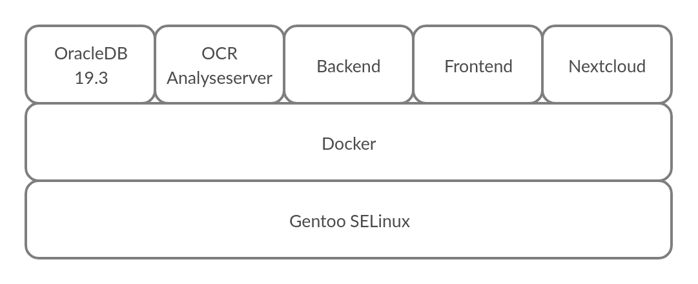

Der Gesamte Softwarestack aus diesem Projekt läuft auf einer Dockerinstanz. Bei der Wahl von Containerlösungen muss immer ein Kompromiss zwischen Sicherheit, Komfort und Geschwindigkeit getroffen werden. In diesem Projekt wurde versucht den bekannten Komfort und die Geschwindigkeit sowohl beim Ausrollen der Software, als auch in ihrem Betrieb weiterhin zu nutzen. Trotzdem wurde versucht diese weiter voneinander zu Isolieren, wie es bei virtuellen Maschinen der Fall ist, damit im Fall einer Kompromitierung eines Containers den Schaden so gering wie möglich zu halten. Für die Umsetzung wurden bekannte SELinux Erweiterungen sowohl auf Datei- als auch auf Netzwerkebene implementiert. Das Ziel ist dabei gewesen, die Sicherheit ein wenig zu optimieren, ohne die Benutzung der Dockerinstanz selber dabei zu beeinträchtigen.

Der mit Abstand größte Container hinsichtlich des benötigten Arbeits- und Massenspeicher ist die Oracle Datenbank in Version 19.3. Für die Installation wurde ein dafür angefertiges Skript verwendet, woduch die Installation der Datenbank automatisiert wurde und entsprechende Benutzer, Tablespaces und Berechtigungen angelegt wurden.

Zum Speichern der in diesem Projekt anfallenden Daten haben wir uns entschieden, ein dafür geeignetes System einzusetzen, anstatt eine eigene Lösung zu implementieren. Dafür haben wir eine Nextcloudinstanz verwendet, natürlich auch als Containerlösung. Für die tatsächliche Datenablage wurde intern ein gewöhnliches EXT4 Dateisystem verwendet. Alternativ hätte sowohl zu Beginn des Projekts, als auch in Zukunft ein externer Objekt- oder Blockspeicher eingebunden werden. Möglich ist es durch die von uns verwendete WebDav Schnittstelle von Nextcloud. So überlassen wir einem Service der hervoragend mit Daten umgehen kann, auch das Speichern dieser.

Neben der Oracle Datenbank und dem Nextcloudserver läuft noch ein OCR Analyseserver, das Frontend und das Backend als Containerinstanz auf dem Server.

### OCR Analyse

Beim der OCR (Optical Character Recognition) wird versucht, aus einem gegebenen Bild so viele Zeichen wie möglich zu extrahieren. Dafür exestieren verschiedene Verfahren, die unterschiedlich zuverlässig arbeiten und auch unterschiedlich viel kosten. Die Zeichenerkennung von Abbyy beispielsweise fängt bei ca. 100€ an und kostet mehr, jenachdem ob eine Server- oder Mehrbenutzerlizenz benötigt wird. Ähnlich wie bei den Preismodellen bei Oracle muss bei den Serverversionen für jeden Kern eines Prozessors eine einzelne Lizenz erworben werden. Eine andere Option ist das verwenden von freier Software. In diesem Projekt haben wir Tesseract für die Teichen- bzw. Wörtererkennung verwendet. In ersten Tests hat sich gezueigt, dass die reine Texterkennung nicht zufriedenstellend funktioniert. Deswegen werden von unserer Software alle Eingabedokumente für eine spätere Analyse optimiert. Das geschieht in 6 Schritten und wurde mit OpenCV umgesetzt.

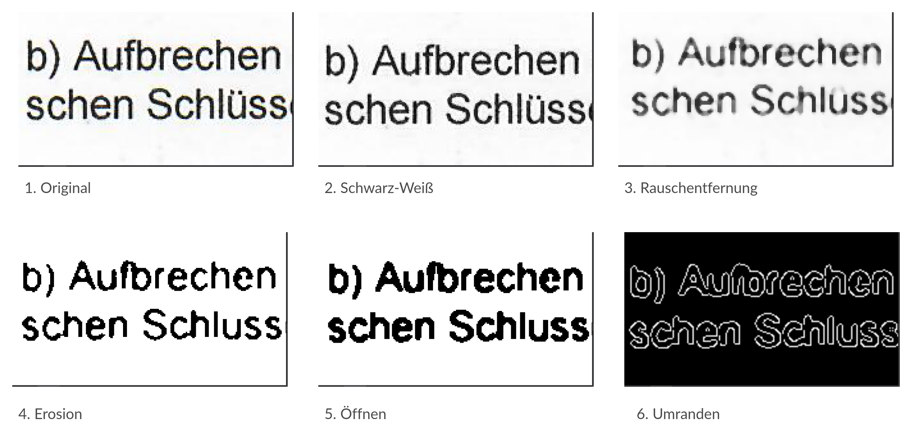

In der oberen Grafik ist im ersten Ausschnitt das originale Dokument zu erkennen. Die Optimierung verringert die Farben auf Graustufen, wie im zweiten Ausschnitt zu sehen ist. Auch hier ist die Texterkennung noch nicht sehr gut, da um die Buchstaben herum noch ein klares Rauschen zu sehen ist. Im dritten Ausschnitt wurde das Rauschen entfernt, wobei auch die Buchstaben selber leicht beschädigt wurden. der vierte Schritt verbessert den Kontrast und versucht die Ursprünglichen Buchstaben wiederherzustellen. Wie gut zu erkennen ist, werden vom Wort *Schlüssel* die Punkte vom *Ü* entfernt. Solche Fehler passieren ab und zu und führen zu einer Falscherkennung einzelner Buchstaben. Da durch diese Verfahren jedoch die Gesamterkennungsrate der meisten Buchstaben deutlich verbessert wird, werden diese Einschränkungen akzeptiert. Im fünften Schritt werden die Buchstaben nicht vergrößert, aber fett errechnet. Das ist für den letzten Schritt notwendig, da sonst Buchstaben verloren gehen können. Hier werden ausschließlich die Kanten der Buchstaben benötigt.

Nach der Texterkennung der einzelnen Wörter wird eine Prozedur in der Datenbank aufgerufen, die den Volltext des Dokuments erwartet. Intern wird dieser wieder in seine einzelnen Wörter unterteilt und anschließend für eine Spätere Volltextsuche gespeichert.

Zum Schluss wird eine finale PDF erstellt. Diese enthällt das Bild im Hintergrund und den erkannten Text in einem Overlay darüber. So kann im Hintergrund ein Wort mit einem PDF Reader markiert werden, wodurch tatsächlich das Wort im Overlay ausgewählt wird.

### Nextcloud

Ein selbst gehosteter Nextcloud Server wird bei diesem Projekt als Webspeicher für die hochgeladenen Dokumente und generierten PDFs genutzt. Zum Hoch- und Runterladen der Dateien wird die WebDAV Schnittstelle der Nextcloud verwendet.

### Oracle Datenbank

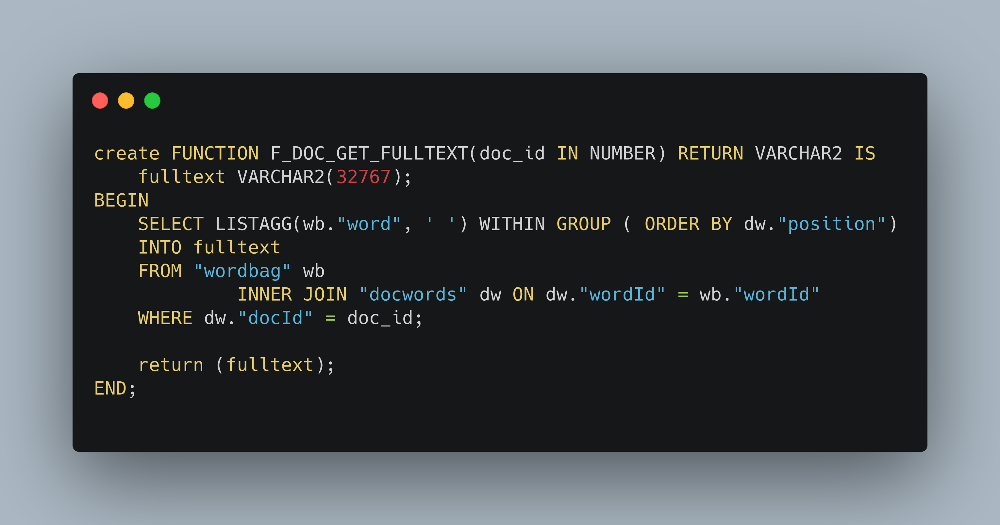

Die Funktion F_DOC_GET_FULLTEXT erwartet die ID eines Dokuments und gibt seinen Volltext zurück.

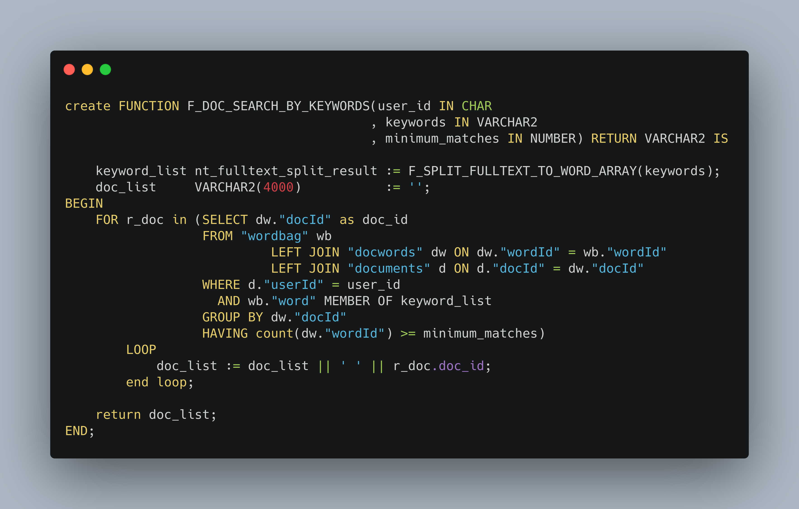

Die Funktion D_DOC_SEARCH_BY_KEYWORDS erwartet eine Benutzer ID, die Wörter nach denen gesucht werden soll und die minimale Anzahl an Treffern, die das gesuchte Dokument mindestens aus diesen Keywords haben soll. Dabei ist diese Suche anders wie bei den Standardsuchmaschinen: Jedes weitere Keyword erweitert nicht die Suche nach weiteren Dokumenten, sondern schränkt diese weiter ein. Dadurch können die meisten Dokumente mit drei bis vier Keywords gefunden werden. Beispiel: **Rechnung Telekom Juni 2020**.

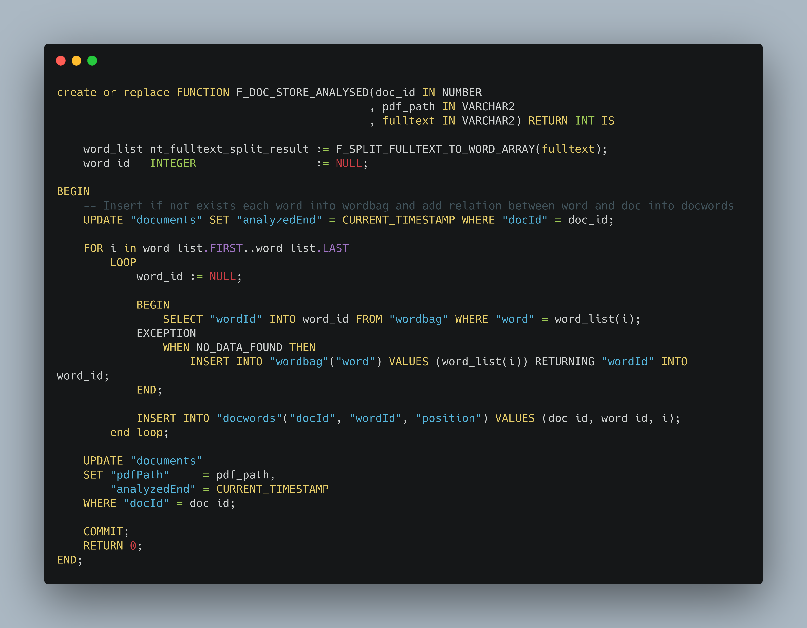

Mit der Funktion F_DOC_STORE_ANALYZED kann der Volltext zu bereits vorhandenen Dokumenten ergänzt werden. Diese Funktion wird nur vom OCR Analyseserver aufgerufen. Als Eingabewert wird die Dokumenten ID, der Pfad in der Nextcloud zum OCR_PDF und der Volltext erwartet. Intern wird versucht kein Wort doppelt zu speichern. So kann später über die Volltextsuche später das Dokument effizient gefunden werden, das gespeicherte Wort selber hat einen eigenen Index.

### Node JS

Genutzt für dieses Projekt wird ein mit Docker gehosteter Node Container mit der LTS Version. Bei der Strukturierung des Backends haben wir eine modulare Struktur genutzt. Folgende Module und Libraries verwenden wir.

#### Database ORM Adapter

Um das Backend mit der Datenbank zu verwenden wird das ORM Framework `Sequelize` genutzt. Da dieses in der aktuellen Version keine Oracle Datenbank unterstützt, wird auf einen Fork dieses Frameworks in der Version 3 zurückgegriffen Um dieses nutzen zu können wird darüber hinaus eine Library verwendet, welche die Oracle Datenbanktreiber enthält. Innerhalb des Datenbankadapters verwenden wir eine Model und Controller Struktur. Für jede Datenbanktabelle wurde somit ein Model und ein Controller angelegt. Das Model enthält die Tabellendefinition und im Controller sind alle Datenbankoperationen und Funktionsaufrufe zu finden, welche mit dieser Tabelle zusammenhängen. Folgende Libraries sind dafür im Node Server notwendig:

- [sequelize-oracle](https://www.npmjs.com/package/sequelize-oracle)

- [oracledb](https://www.npmjs.com/package/oracledb)

Eine beispielhafte Anwendung der Sequelize Oracle Bibliothek findet man im folgenden Beispiel. Dabei ist eine Definition des Models `Tag` zu sehen. Dieses stellt die Datenbanktabelle `tags` dar. Anschließend wird eine n:m Beziehung zwischen Dokumenten und Tags erstellt. Darunter ist beispielhaft zu sehen, wie man mit Sequelize auf ein Model eine Suchquery ausführen kann. In diesem Falle werden alle Dokumente gesucht, welche zu einem Nutzer gehören. Rückgabe ist ein Array aus JSON Objekten, welche die Dokumente darstellen, welche gefunden wurden. Durch das Inkludieren des Tag Models, besitzt jedes Dokumentenobjekt ein Subarray in dem alle Tags enthalten sind.

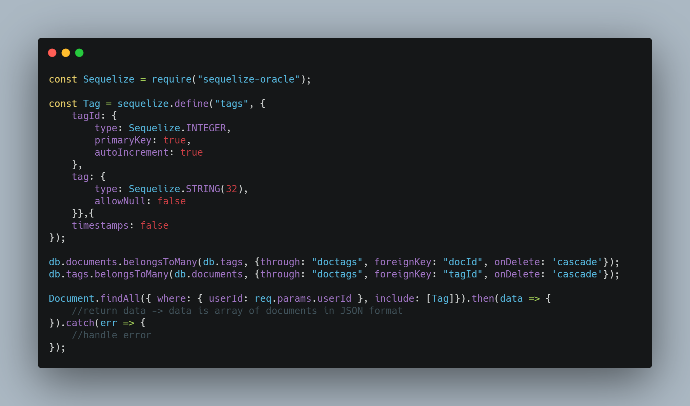

#### REST Server

Damit die Webanwendung mit dem Backend kommunizieren kann arbeiten wir mit REST Routen. Dafür ist auch eine Middleware notwendig, welche den Request Body parsen kann. Einige REST Routen sind dabei so definiert, dass diese direkt die Funktionen aus den Datenbank Controllern aufrufen, womit es sehr einfach ist Datenbankoperationen aus der Webanwendung zu triggern. Folgende Libraries für Node werden verwendet:

- [express ](https://www.npmjs.com/package/express)
- [body-parser](https://www.npmjs.com/package/body-parser)

Im nachfolgenden Snippet ist der Aufbau des REST Servers verdeutlicht. Zunächst wird dabei mit Express und dem Bodyparsers der Server initialisiert. Diesem werden dann verschiedene Routen zugewiesen. Im Beispiel sind die Routen für die Kategorien zu sehen. Dabei kann direkt der Tag Controller eingebunden werden. Dadurch lassen sich die Datenbankfunktionen direkt über die REST Routen aufrufen. Schlussendlich wird dann der Server gestartet.

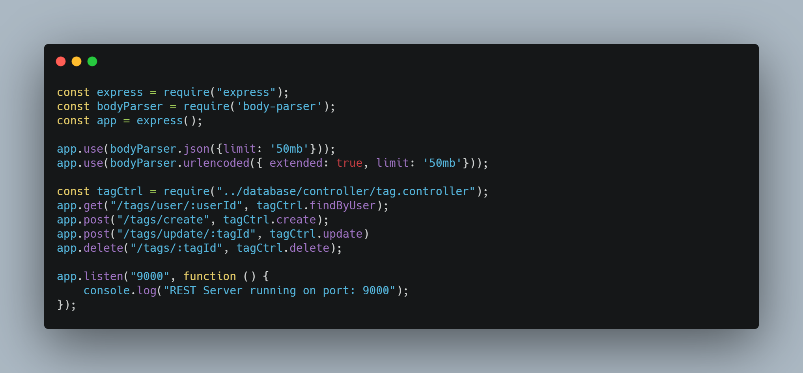

#### Firebase Adapter

Da die Anwendung nutzerbasiert funktionieren soll, ist eine Authentifizierungsmöglichkeit notwendig. Diese ist mit Hilfe von Firebase umgesetzt. Dies ist ein Google Service, zur Nutzerverwaltung und Authentifizierung. Für die Funktionalität der Firebase gibt es die Admin und die Client Lib. Auf der Serverseite wird dabei das Admin SDK für Node verwendet, um Funktionen, wie z.B die Nutzerverifizierung oder die Registrierung neuer Nutzer, durchführen zu können. Folgende Libraries für Node werden verwendet:

- [firebase-admin](https://www.npmjs.com/package/firebase-admin)

Für die Ausführung der Admin Library ist es notwendig sich im Firebase Account ein Dienstkonto anzulegen sowie einen privaten Schlüssel dafür zu generieren. Anschließend kann mit diesem eine Verbindung hergestellt werden. Der folgende Screenshot zeigt die Ansicht in der Einstellungskonsole der Firebase:

Nachdem ein privater Schlüssel exportiert wurde, kann dieser im Projektorder abgelegt werden und der Pfad kann genutzt werden um die Verbindung mit dem Server zu initialisieren. Anschließend kann das Authentifizierungsobjekt der genutzt werden, um Funktionen wie z.B die Nutzerregistrierung auszuführen. Das folgende Code Snippet zeigt eine Initialisierung der Verbindung zum Server und eine Anschließende Registrierung eines Nutzers. Dieser wird zunächst mit Hilfe der Firebase registriert und anschließend in der Datenbank abgelegt.

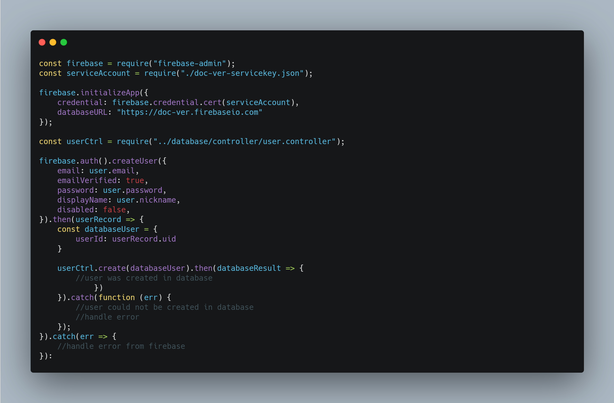

Nachdem Nutzer registriert wurden, können diese auch in der Authentifizierungsübersicht im Firebase Account eingesehen werden. Dort wird eine Liste von E-Mail, User ID sowie dem letzten Login angezeigt wie nachfolgend zu sehen ist. In dieser Ansicht können Nutzer auch manuell aktiviert, deaktiviert oder gelöscht werden.

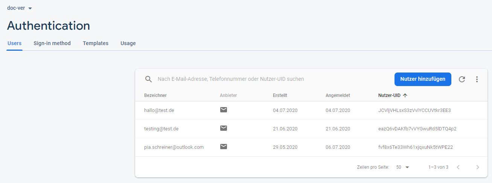

#### Nextcloud Adapter

Da in der Datenbank nur der Dokumentenpfad gespeichert wird, ist es notwendig zusätzlich einen WebDAV Dienst zu nutzen, welcher die hochgeladenen Dateien nutzerbasiert speichert. Dabei haben wir uns für den Dienst Nextcloud entschieden. Dieser bietet eine einfache Client API mit Hilfe dessen Dateien erstellt, ausgelesen und gelöscht werden können. Folgende Libraries für Node werden verwendet:

- [nextcloud-node-client](https://www.npmjs.com/package/firebase-admin)
- [file-type](https://www.npmjs.com/package/file-type)

Im Rootverzeichnis unseres Nextcloud Speichers existiert der Ordner `userfiles`. Darin wird für jeden Nutzer, welche Dokumente hochlädt ein Ordner angelegt, welcher den Namen der User ID trägt. In diesem Ordner werden die Dateien abgelegt. Der Name der Datei besteht dabei aus dem Dateinamen sowie einer UUID. Die analysierte Datei wird als PDF auch in diesem Ordner abgelegt. Der folgende Screenshot zeigt einen Ausschnitt einer User Ordners in der Nextcloud:

Für die Anbindung an die Nextcloud muss zunächst ein Client Objekt mit URL, Nutzername sowie dem Passwort initialisiert werden. Anschließend lassen sich auf das Client Objekt Funktionen ausführen. Im nachfolgenden Beispiel ist der Abruf einer Datei zu sehen, welcher in der Nextcloud liegt. Um diese Datei abzurufen, wird der Dateipfad benötigt, welcher in der Datenbank gespeichert ist.

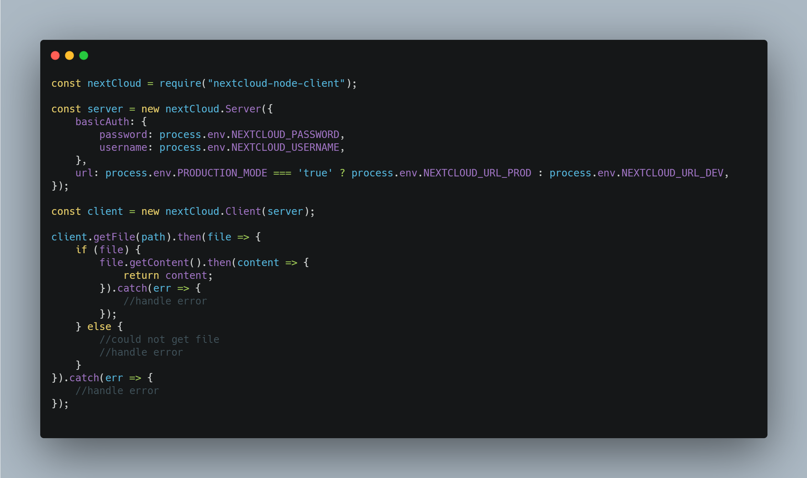

#### Logging

Um nach dem Deploy auf die Umgebung einfach Fehler finden zu können, wurde ein Logging System implementiert. Dabei gibt es drei verschiedene Dateien (Info, Error, Debug), welche mit Hilfe einer REST Route erreichbar sind und welche den Loginhalt basiert auf Logleveln ausgeben können. Folgende Libraries für Node werden verwendet:

- [fs](https://www.npmjs.com/package/fs)
- [util](https://www.npmjs.com/package/util)

### Angular

#### Design und Routing

Das Design der Webanwendung basiert grundsätzlich auf dem Bootstrap Framework in der Version 4. Da dieses aber keine Icons enthält sowie einige andere nützliche Komponenten nutzen wir zusätzlich die Angular Material Bibliothek, dessen Icons wir verwenden. Die Anwendung ist dabei komplett responsiv und passt sich auf alle Endgeräte mit der Größe an. Um das Design modern wirken zu lassen, werden bei allen Aktionen mit dem Backend Push Notifications angezeigt, welche dem Nutzer den Status der Aktion mitteilen. Diese können beliebig platziert werden, je nachdem ob gerade ein Modal geöffnet ist, oder nicht. Folgende Libraries werden dabei für das Design genutzt:

- [@ng-bootstrap/ng-bootstrap](https://www.npmjs.com/package/@ng-bootstrap/ng-bootstrap)
- [@angular/material](https://www.npmjs.com/package/@angular/material)
- [ngx-toastr](https://www.npmjs.com/package/ngx-toastr)

Die Ansicht der Anwendung ist dabei grundsätzlich zweigeteilt. Oben auf Seite befindet sich eine Navigationsleiste, welche fix ist und nicht mitscrollt. Darunter befindet sich eine Content View. Die Navigationsleiste ist über einen Navigationskomponenten umgesetzt, welcher bei App Start geladen wird. Basierend vom Navigationskomponent werden die anderen Inhaltskomponenten mit Hilfe des Angular Routings in die Content View hineingerendert, sodass immer der Navigationskomponent sowie der jeweilige Inhaltskomponent aktiv ist. 

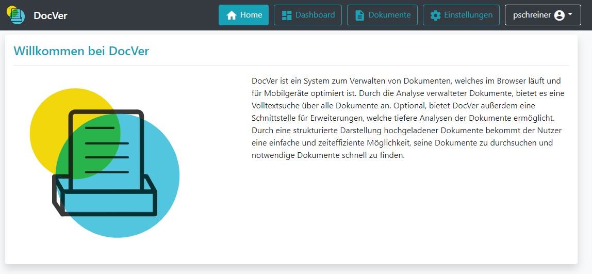

#### Authentifizierung

Für die Nutzerauthentifizierung in der Webanwendung nutzen wir die clientseitige Firebasebibliothek, welche z.B. Funktionen wie Login und Passwort zurücksetzen anbietet. Dabei erstellen wir uns einen Eintrag im Local Storage, wenn der Nutzer eingeloggt ist, um diesen eingeloggt zu lassen, sollte die Seite neu geladen werden. Der Nutzer wird dabei automatisch ausgeloggt, sollte das Token der Firebase auslaufen und somit kann der Nutzer nicht dauerhaft eingeloggt bleiben. Für die Nutzung von Firebase innerhalb von Angular nutzen wir die folgende Bibliothek.

- [@angular/fire](https://www.npmjs.com/package/@angular/fire)

Dabei handelt es sich um eine clientseitige Realisierung der Firebase. Diese muss wie die Admin Variante ebenfalls mit dem Firebase Server registriert werden. Dafür werden eine Verbindungsinformationen benötigt. Sobald die Verbindung registriert wurde, kann wie bei der Admin Variante auch auf Funktionen zugegriffen werden. Das nachfolgende Snippet zeigt eine beispielhafte Initialsierung innerhalb von Angular sowie das Anmelden eines Nutzers.

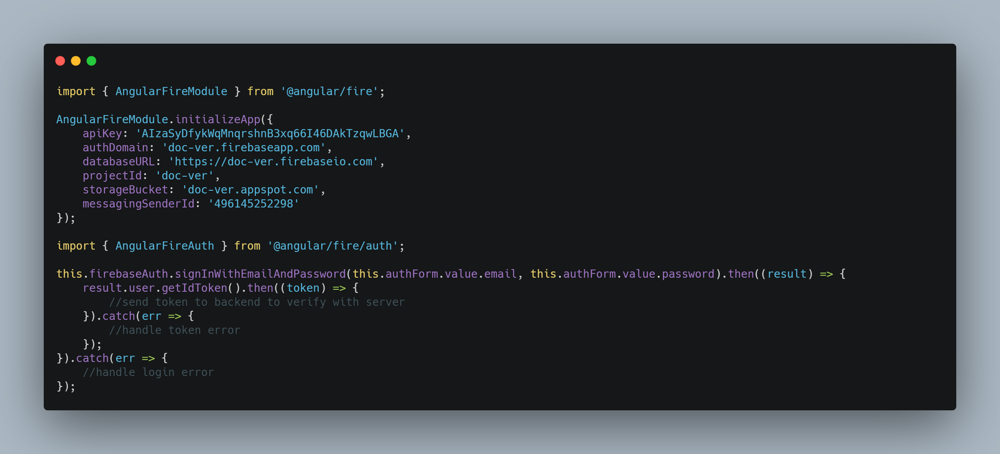

#### Dokumentendetail Anzeige

Der Hauptfokus der Anwendung ist die Dokumentenverwaltung. Im Rahmen dieser, kann man sich von allen Dokumenten in der Liste eine Detailansicht anzeigen lassen. Diese bietet eine Dreiteilung der Ansicht mit Hilfe einer Tableiste. Im ersten Tab wird dabei das hochgeladene Bild oder die hochgeladene PDF als original Datei angezeigt. Der zweite Tab stellt eine Volltextvorschau des Dokumententextes dar und der dritte Tab stellt die generierte PDF nach der OCR Analyse mit Hilfe eines PDF Viewers da. Dafür werden die anzuzeigenden PDFs als eingebetteter Viewer angezeigt, welcher auch Funktionalitäten wie z.B. die Suche anbietet. Der nachfolgende Screenshot zeigt eine Darstellung der Detailansicht eines Dokumentes:

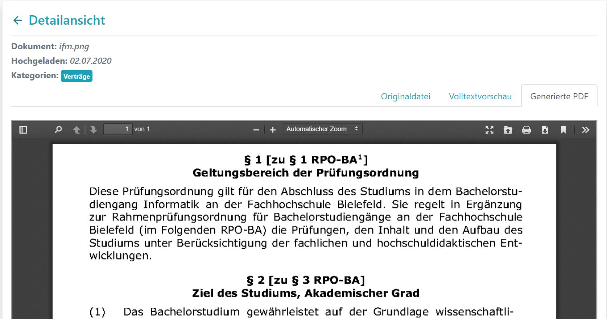

Für die Darstellung des nutzen wir folgende Bibliothek.

- [ng2-pdfjs-viewer](https://www.npmjs.com/package/ng2-pdfjs-viewer)

Die Nutzung einer Library im Gegenteil zur Einbettung des PDFs mit Hilfe von HTML5 hat den Vorteil, dass wir Zugriff auf eine Suchfunktion, eine ausklappbare Seitenleiste sowie weitere Funktionen haben, welche die HTML5 PDF nicht bietet. Um ein PDF anzeigen zu können wird in der HTML Datei ein Eintrag für den Viewer angezeigt und eine ID zugewiesen. Mit Hilfe dieser Id kann das DOM Element im Angular Komponenten mittels ViewChild eingebunden und verwendet werden. Sobald die Detailansicht für ein Dokument geöffnet wird, wird die PDF Datei vom Server abgefragt und als Base64 String zurückgeliefert. Dieser kann zu Blob formatiert werden und in das DOM Element geladen werden. Dieser Vorgang ist im folgenden Code Snippet zu sehen:

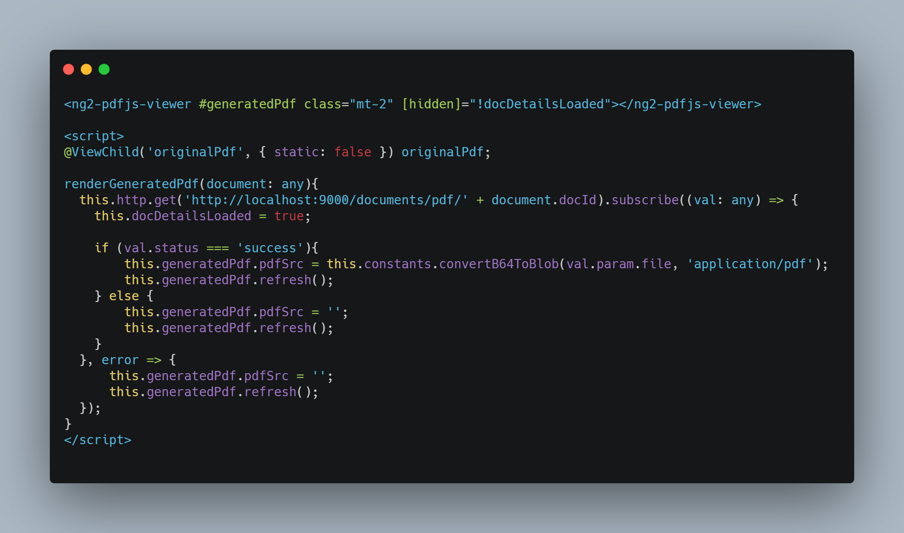

#### Klassifizierung mit Kategorien

Um dem Nutzer eine gute Usability zu bieten, verwenden wir ein Tag Input Feld. Dieses bietet eine Vorauswahl der vorhandenen Kategorien und ein einfaches Entfernen bereits vorhandener Kategorien von einem Dokument. Auch können so sehr einfach neue Kategorien hinzugefügt werden, welche vorher nicht existiert haben. Dieses Tag Input Feld wird in allen Komponenten verwendet. Auf der Dokumentenübersicht sowie beim Dokument hochladen ist dieses Feld editierbar. Auf dem Dashboard wird das Tag Input Feld nur genutzt, um vorhandene Kategorien hinzuzufügen. Hier ist kein Bearbeiten möglich.

- [ngx-tags-input](https://www.npmjs.com/package/ngx-tags-input)

- https://www.npmjs.com/package/ng-connection-service)

## Fazit

Schlussendlich kann man sagen, dass innerhalb dieses Projekts ein solides System entstanden ist, trotz der begrenzten Zeit auf Grund des wegen Corona verkürzten Semesters. Dies ist auf die gute Teamarbeit mit fester Zeiteinteilung und regelmäßigen Absprachen zurückzuführen. Dennoch sind wir zu dem Schluss gekommen, dass es nicht sinnvoll und oftmals nicht zielführend ist ein modernes ORM Framework in Zusammenhang mit einer Oracle Datenbank zu nutzen. Außerdem lässt sich sagen, dass das Erstellen von Datenbank Funktionen innerhalb einer Oracle Datenbank sehr mühsam ist. Dies liegt unter anderem auch an den schlechten Debugging Möglichkeiten. Außerdem haben wir festgestellt, dass die Anbindung an Nextcloud als WebDAV Dienst an einigen stellen hakt und daher einzelne Funktionen etwas langsam sind.

## Ausblick

Im derzeitigen Stand der Suche nach Keywords werden Satzzeichen nicht vom Wort getrennt. Um die Suche zu verbessern wäre es daher möglich Satzzeichen ebenfalls als Wörter zu behandeln. Dadurch könnte effizienter gesucht werden, da mehr Suchergebnisse erzielt werden können. Weiterhin könnte die Authentifizierung erweitert werden. Dabei wäre zum einen denkbar die Authentifizierung mit Hilfe der Firebase mit eigener eigenen Lösung zu ersetzen und zum anderen könnte eine höhere Sicherheit der REST Schnittstellen durch Authentifizierung erreicht werden. 

Als Erweiterung des Systems wäre außerdem eine automatische Klassifizierung denkbar, die hochgeladene Dokumente automatisch in die passende Kategorie einsortieren kann. Außerdem wäre eine Schnittstelle mit erweiternder Funktionalität möglich, die tiefere Analysen der Dokumente durchführt und es ermöglicht, Zusatzmodule zu implementieren, welche die Daten analysieren. Ein Beispiel dafür wäre ein automatisches Fahrtenbuch, das aus Daten von Tankquittungen erstellt wird.

Auch die Benutzerusability könnte verbessert werden, indem man z.B. Dokumente, welche austehend sind automatisch aktualisiert, ohne dies manuell anzufragen. Dies könnte beispielsweise mit Hilfe von Websockets implementiert werden. Außerdem könnte das Ausloggen beim Ändern der E-Mail durch eine Passwortbestätigung vom Nutzer umgangen werden. Diese würde dann genutzt werden, um den Nutzer nahtlos wieder einzuloggen. Da das Konzept der Offline Nutzung im derzeitigen Stand nicht umgesetzt werden konnte, wäre dies auch eine simple Erweiterungsmöglichkeit um die Nutzerakzeptanz zu erhöhen.