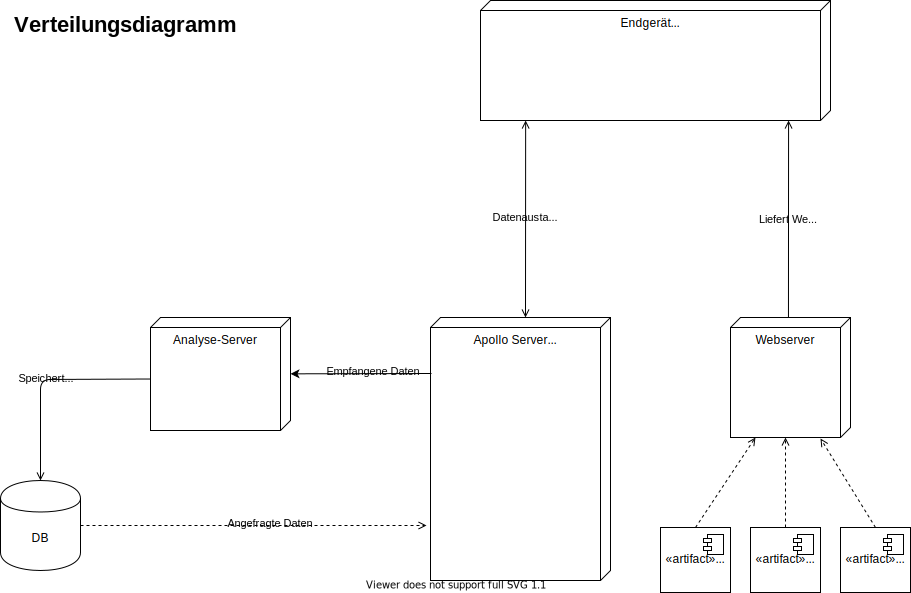

# Expose

- **Typ:** Projektarbeit im Modul Datenbankanwendungen
- **Titel:** DocVer
- **Authoren:**

## 1 Vorstellung des Projekthemas

### Beschreibung
- Was soll entwickelt werden?
- Wie wird das Problem durch die entwickelte Anwendung behoben/vereinfacht

###  Anforderungen

#### Grundanforderungen:

 - digitalisierte Dokumente (Foto, Scan etc.) verwalten
 - mit DB synchronisieren
 - klassifizieren
 - von Server analysieren lassen
 - Volltextsuche über analysierte Dokumente
 - Übersicht über Dokumente
 - mobil benutzbar (Smartphone/Tablet)

#### Optionale Anforderungen

 - automatische Klassifizierung
 - Schnittstelle für Zusatzmodule mit erweiternder Funktionalität (z.B. zum weitergehenden Analysieren bestimmter Dokumente)

#### Stakeholder
| Funktion / Relevanz | Name | Kontakt / Verfügbarkeit | Wissen | Interessen / Ziele |
|---|---|---|---|---|
| xxx | xxx | xxx | xxx | xxx | xxx |

#### User Stories
| Funktion | Rolle | In meiner Rolle möchte ich | so dass | Akzeptanz | Priorität |
| --| --| -- | -- | -- | -- |
| xxx | xxx | xxx | xxx | xxx | xxx |

## 2 Geplante Projektarbeit

### Rollenverteilung / Zuständigkeiten

### Kommunikationskanäle
- Discord
- Whatsapp

## 3 Marktanalyse/Stand der Technik

- Gibt es schon vergleichbare Produkte in der Forschung oder am Markt?
	- Abbyy (OCR)
	- Docusnap
- Wie hebt sich die Anwendung von der Konkurrenz ab?
- Wie lösen andere das Problem? Wovon kann man sich inspirieren lassen?

## 4 Verwendete Technologien

### Datenbank (Oracle / Relational / NoSQL)

- Mongo/Oracle/…
  - Referenz zu Dateien im WebDav
  - Volltext ohne Wordposition
- WebDav (Nextcloud)
  - Dateien
  - Durchsuchbare PDF ~2-5MB

### Frontend (Desktop / Webanwendung / Mobil)

- Angular
- Progressive Web App (PWA)
- Responsive Web Design

### Backend (Sprache)

- Apollo Server
- GraphQL (Datenaustausch)

### Kommunikation Server / Client

- DB ↔ GraphQL ↔ Angular ↔ Client
- Datei ↔ Client ↔ Webdav ↔ OCR API ↔ WebDav
- OCR API ↔ [Volltext] ↔ DB

#### Verteilungsdiagramm

sdiagramm

### Code Versionierung / Kollaboratives arbeiten

- Git

## 5 Zeitplanung

### Meilensteine

- **Meilenstein 1:** Konzept und Mockup
- **Meilenstein 2:** Prototyp und Dokumentation
- **Endabgabe:** Finales Produkt

### Wochenplanung

| Woche| Planung |
|--|--|
| 20.04.20 - 26.04.20 | Kick Off |
| 27.04.20 - 03.05.20 | Recherche + Machbarkeit und Prototyp Architektur |
| 04.05.20 - 10.05.20 | Überarbeitete Prototyp Architektur und Mockup Ideen |
| 11.05.20 - 17.05.20 | Mockup und OCR fertig |
| 18.05.20 - 24.05.20 |  |
| 25.05.20 - 31.05.20 |  |
| 01.06.20 - 07.06.20 |  |
| 08.06.20 - 14.06.20 |  |
| 15.06.20 - 21.06.20 |  |
| 22.06.20 - 28.06.20 |  |
| 29.06.20 - 05.07.20 |  |
| 06.07.20 - 12.07.20 |  |
| 13.07.20 - 19.07.20 |  |

## A Gliederungsentwurf

 1. Einleitung
 2. --
 3. --
 4. --
 5. Evaluierung
 6. Fazit
 7. Ausblick

## B Vorläufiges Literaturverzeichnis
Überblick über die bisher ermittelten Literaturquellen (Alphabetisch nach den Namen der Autoren sortiert)

### Literatur
[ABC] Beschreibung