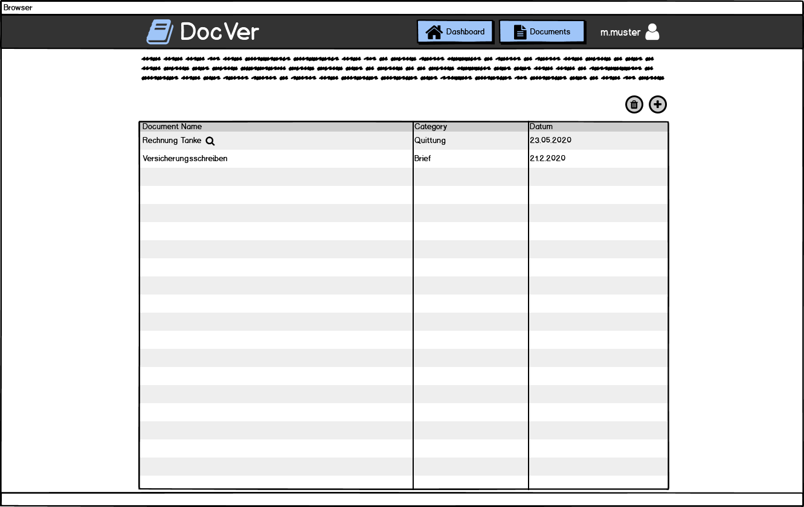


# Expose

- **Typ:** Projektarbeit im Modul Datenbankanwendungen
- **Titel:** DocVer
- **Autoren:** 

## 1 Vorstellung des Projekthemas

### Beschreibung

DocVer ist ein System zum Verwalten von Dokumenten, das im Browser läuft und für Mobilgeräte optimiert ist. Es bietet eine Volltextsuche über alle Dokumente, die zuvor analysiert und in durchsuchbare PDFs umgewandelt wurden. Falls die Zeit reicht, soll außerdem eine Schnittstelle für Erweiterungen gegeben werden, die auch tiefere Analysen der Dokumente ermöglichen, wie z.B. ein automatisches Fahrtenbuch aus Daten von Tankquittungen.
Durch diese Funktionen soll die Übersicht, über alle gespeicherten Dokumente vereinfacht und dem Nutzer Zeit gespart werden.

###  Anforderungen

#### Grundanforderungen:

 - digitalisierte Dokumente (Foto, Scan etc.) verwalten
 - mit DB synchronisieren
 - klassifizieren
 - von Server analysieren lassen
 - Volltextsuche über analysierte Dokumente
 - Übersicht über Dokumente
 - mobil benutzbar (Smartphone/Tablet)

#### Optionale Anforderungen

 - automatische Klassifizierung
 - Schnittstelle für Zusatzmodule mit erweiternder Funktionalität (z.B. zum weitergehenden Analysieren bestimmter Dokumente)

#### Randbedingungen:

- Chrome -> File API?

#### Stakeholder
| Funktion / Relevanz | Name | Kontakt / Verfügbarkeit | Wissen | Interessen / Ziele |
|---|---|---|---|---|
| Interessent (Möchte DocVer nutzen) | Martin Meyer | Tel. 2837462, von 16-20 Uhr telefonisch erreichbar | Manuelle Dokumentenverwaltung ist ihm zu aufwendig | Möchte Zugang zu dem Service bekommen |
| Nutzer | Franz Müller | Tel. 2871239, von 12-18 Uhr telefonisch erreichbar | Anmeldedaten, Welche Dokumente sollen verwaltet werden | Möchte seine Dokumente verwalten |

#### User Stories
| Funktion | Rolle | In meiner Rolle möchte ich | so dass | Akzeptanz | Priorität |
| --| --| -- | -- | -- | -- |
| Registrierung | Interessent | mich bei DocVer registrieren | für mich ein Konto erstellt wird | Registrierung möglich | Hoch |
| Einloggen | Nutzer | mich bei DocVer einloggen | ich den Service benutzen kann | Einloggen möglich | Hoch |
| Dokument hochladen | Nutzer | Dokumente hochladen | der DocVer diese verwalten kann | Hochladen möglich | Hoch |
| Dokumente durchsuchen | Nutzer | meine Dokumente durchsuchen | ich das richtige Dokument finde | Dokument gefunden | Hoch |
| Dokumentinhalt ansehen | Nutzer | den Text eines Dokuments ansehen | ich einen Überblick über den Inhalt bekomme | Textinhalt angezeigt | Hoch |
| Dokument ansehen | Nutzer | ein ausgesuchtes Dokument ansehen | ich mir Original anschauen kann | Dokument angezeigt | Mittel |

### Graphische Benutzerschnittstelle

## 2 Geplante Projektarbeit

### Rollenverteilung / Zuständigkeiten

- ?

### Kommunikationskanäle
- Discord
- Whatsapp

## 3 Marktanalyse/Stand der Technik

- Gibt es schon vergleichbare Produkte in der Forschung oder am Markt?
	- Abbyy (OCR)
	- Docusnap
- Wie hebt sich die Anwendung von der Konkurrenz ab?
- Wie lösen andere das Problem? Wovon kann man sich inspirieren lassen?

## 4 Verwendete Technologien

### Datenbank (Oracle / Relational / NoSQL)

- Oracle -> SSH Zugang Linux
  - ggf. Nutzerdaten
  - Referenz zu Dateien im WebDav
  - Volltext ohne Wordposition
- WebDav (Nextcloud)
  - Dateien
  - Durchsuchbare PDF ~2-5MB
- Offline DB (Index Browser) -> Evaluation
  - Cache

### Frontend (Desktop / Webanwendung / Mobil)

- Angular
- Progressive Web App (PWA)
- Responsive Web Design

### Backend (Sprache)

- NodeJS Server
  - Apollo - GraphQL (Datenaustausch)
  - FirebaseAdmin - Usercreation / Verifizierung
- OCR Server
- Arbeitspaket -> API Input Keywords / Response Vorkommen in Datei

### Environment

- Docker

### Kommunikation Server / Client

- DB ↔ GraphQL ↔ Angular ↔ Client
- Datei ↔ Client ↔ Webdav ↔ OCR API ↔ WebDav
- OCR API ↔ [Volltext] ↔ DB

### Code Versionierung / Kollaboratives arbeiten

- Git

## 5 Zeitplanung

### Meilensteine

- **Meilenstein 1:** Konzept und Mockup
- **Meilenstein 2:** Prototyp und Dokumentation
- **Endabgabe:** Finales Produkt

### Wochenplanung

| Woche| Planung |
|--|--|
| 20.04.20 - 26.04.20 | Kick Off |
| 27.04.20 - 03.05.20 | Recherche + Machbarkeit und Prototyp Architektur |
| 04.05.20 - 10.05.20 | Überarbeitete Prototyp Architektur und Mockup Ideen |
| 11.05.20 - 17.05.20 | Klickdummy für Webanwendung und OCR fertig, Datenbankarchitektur definiert, NodeJS Server mit Firebase aufgesetzt |
| 18.05.20 - 24.05.20 | Evaluation Oracle DB mit und ohne graphQL, Festlegen der finalen Version der Architektur |
| 25.05.20 - 31.05.20 |  |
| 01.06.20 - 07.06.20 |  |
| 08.06.20 - 14.06.20 |  |
| 15.06.20 - 21.06.20 |  |
| 22.06.20 - 28.06.20 |  |
| 29.06.20 - 05.07.20 |  |
| 06.07.20 - 12.07.20 |  |
| 13.07.20 - 19.07.20 |  |

## A Gliederungsentwurf

Gliederungsentwurf für Dokumentation der Endabgabe

 1. Einleitung
 2. --
 3. --
 4. --
 5. Evaluierung
 6. Fazit
 7. Ausblick

## B Vorläufiges Literaturverzeichnis
Überblick über die bisher ermittelten Literaturquellen (Alphabetisch nach den Namen der Autoren sortiert)

### Literatur
[ABC] Beschreibung
