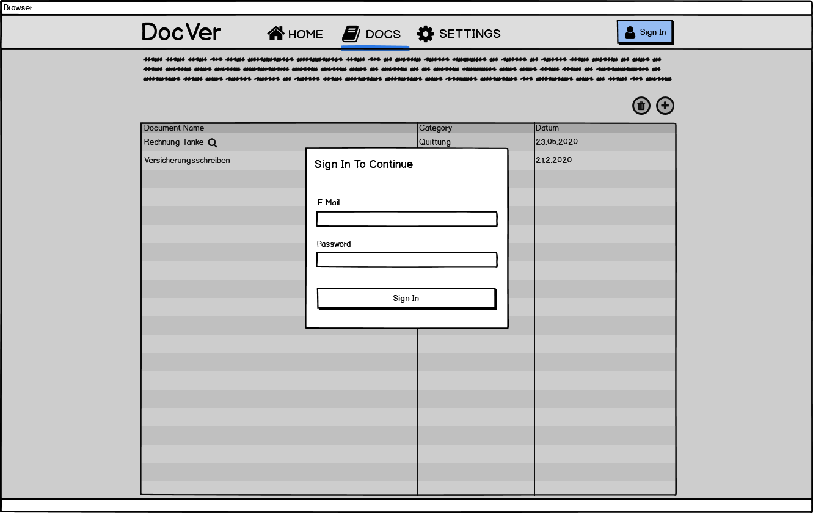
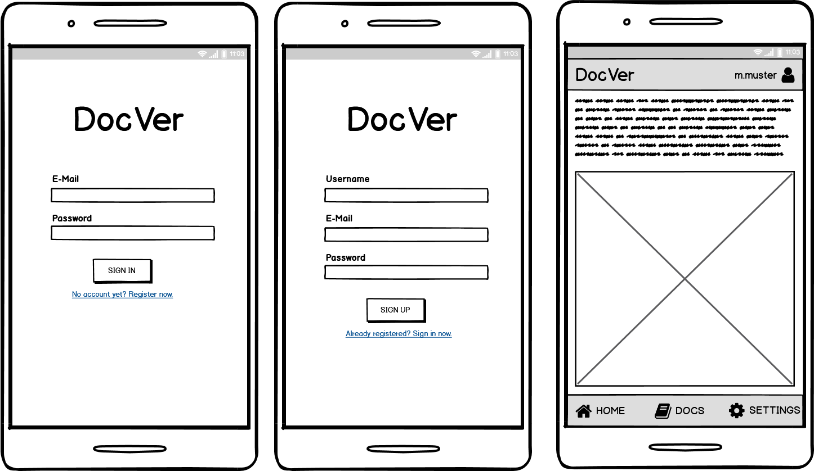

# Mockups

## Zentrale Fragen

- [ ] Username anzeigen wenn eingeloggt oder nur "PROFILE" anzeigen?
- [ ] Welche Version auf mobilem Gerät?

## Desktop

#### Authentifizierung mit Hilfe von Modal

#### Nach Authentifizierung

## Mobile 

#### Version 1

#### Version 2

#### 